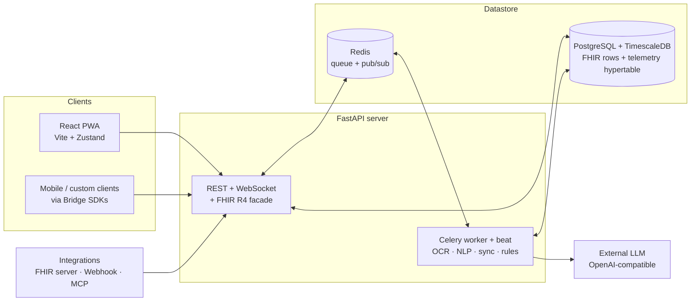

<div align="center">


# Health Assistant
### Self-hosted, privacy-first health data platform

[](https://github.com/health-assistant-io/health-assistant/releases)
[](#scope--limitations)
[](LICENSE)
[](#quick-start)
[](https://fastapi.tiangolo.com/)
[](https://react.dev/)
[](https://www.docker.com/)

<br>

<a href="docs/SCREENSHOTS.md">
  
</a>

<br>

**Website**: [health-assistant.io](https://health-assistant.io) · **Repository**: [health-assistant-io/health-assistant](https://github.com/health-assistant-io/health-assistant)

</div>

> **Independent project.** Health Assistant is inspired by the privacy-first, local-control philosophy of Home Assistant. It is not affiliated with, endorsed by, or connected to Home Assistant or Nabu Casa.

---

## Table of contents

- [What is Health Assistant?](#what-is-health-assistant)
- [What's different](#whats-different)
- [Features](#features)
- [Visual tour](#visual-tour)
- [Quick start](#quick-start)
- [Architecture at a glance](#architecture-at-a-glance)
- [Documentation](#documentation)
- [Tech stack](#tech-stack)
- [Scope & limitations](#scope--limitations)
- [Status & roadmap](#status--roadmap)
- [Contributing](#contributing)
- [Support the project](#support-the-project)
- [License](#license)
- [Disclaimer](#disclaimer)

---

## What is Health Assistant?

A self-hosted web platform for centralizing, monitoring, and analyzing health and wellness data. You run it on your own infrastructure, you own the data, and it speaks **HL7 FHIR R4** natively — not just as an import format.

Under the hood it augments FHIR storage with two things a plain FHIR server doesn't have:

- a **Biomarker Engine** that normalizes units, scores results against reference ranges, and auto-maps incoming data to a managed catalog; and
- a **TimescaleDB telemetry split** that keeps high-frequency device data (heart rate, steps, CGM) in a time-series hypertable instead of bloating the FHIR observation store.

It is **Beta** software, oriented toward self-hosters, technical home users, and small clinics that want a FHIR-native record they control.

## What's different

- **Your data stays on your infrastructure.** No cloud lock-in, no third-party data resale. The database, object storage, and queue all live wherever you deploy them.
- **FHIR-native storage, plus a real R4 server facade.** Resources are stored as FHIR-enhanced relational rows *and* exposed as a conformant FHIR R4 REST API at `/api/v1/fhir/R4/*` (CapabilityStatement, Bundles, Provenance, tombstones). The facade is the interop surface; the frontend uses faster domain endpoints.
- **The AI assists — it never writes clinical data.** The agentic chatbot proposes actions (create an event, add a medication, define a biomarker); a human reviews and explicitly approves every write through a structural human-in-the-loop wall.
- **One platform for labs and device telemetry.** Discrete clinical results and high-frequency wearable data live in the same record, with frequency-aware routing and OHLC downsampling for the dashboard.

## Features

### Clinical data model

- **FHIR R4-enhanced storage** — FHIR JSONB columns (`code`, `subject`, `value_quantity`) alongside relational columns (`biomarker_id`, `normalized_value`, `relative_score`, `tenant_id`). Validated on write so invalid FHIR never lands in the DB.
- **FHIR R4 server facade** — 18 resources exposed at `/api/v1/fhir/R4/*`: `CapabilityStatement`, search Bundles with pagination, `201` + `Location` on create, `ETag`/`Last-Modified`, soft-delete tombstones (`410 Gone`), Provenance-on-write.
- **Biomarker Engine** — `BiomarkerDefinition` is the canonical identity for a metric (LOINC/SNOMED/CUSTOM coding). Values auto-convert to a system unit via DB-driven multipliers, and a `relative_score` (0.0–1.0) positions each result inside its reference range for lab-agnostic trends. A mapping waterfall (code → name → slug/aliases → auto-create) never drops incoming data.
- **Unified Catalog Registry** — six catalogs (biomarkers, medications, allergies, vaccines, anatomy, taxonomy/concepts) under one CRUD / search / FHIR / edge contract with ownership-based scope tiers (`system` / `tenant` / `user`) and per-item audit history.
- **Knowledge graph** — `concepts` carry multiple domain tags, and typed polymorphic `concept_edges` (25 relation types: `AFFECTS`, `TREATS`, `PREVENTS`, `MEMBER_OF`, `EXAMINES`…) connect any catalog item to any other. A recursive-CTE traversal answers multi-hop queries like *which organ does this biomarker affect → what diseases affect it → what treats them*.
- **TimescaleDB telemetry split** — high-frequency data routes to a hypertable; low-frequency data stays in FHIR rows. Routing is dynamic per biomarker and toggles a batch-migration task. Dashboard downsampling uses `time_bucket_gapfill` + OHLC so spikes survive aggregation.

### Clinical workflows

- **Examinations** — clinical visit containers that group documents, rich-text/Markdown notes, and biomarker results by visit.
- **Clinical Events** — longitudinal journeys (a pregnancy, a chronic-pain episode, a surgical recovery) that span multiple examinations. A JSONB `metadata_schema` drives dynamic, specialty-specific fields rendered by the frontend — no hardcoded forms.
- **Bi-directional visit ↔ event mapping** with a `reason` field giving each examination clinical context inside the journey.
- **Documents** tracked end-to-end through the OCR pipeline with live progress streamed over WebSocket.
- **Draggable, persistent dashboard** (react-grid-layout) with per-patient card layouts saved to the backend.

### AI

- **OCR pipeline** — a vision LLM converts images / PDFs / DICOM into Markdown.
- **NLP pipeline** — Pass 1 maps extracted metrics to existing catalog slugs; Pass 2 generates standardized definitions for unknowns and auto-expands the catalog.
- **Agentic chatbot** — tool-calling with SSE streaming, inline citations, and 20+ tools: hybrid catalog search (trigram + FTS + Reciprocal Rank Fusion), multi-hop graph traversal, telemetry trends, document retrieval, medication lookup.
- **Human-in-the-loop proposals** — the assistant proposes write actions (clinical events, biomarkers/medications added to an examination, new catalog definitions). The user reviews, edits, and explicitly confirms; every write goes through the canonical tenant-scoped REST endpoint. **The AI never writes clinical data directly.** Parallel proposals, partial resume, and auto-resume continuation turns are supported.
- **Magic Fill** — maps unstructured pasted text into structured examination records.
- **Provider-agnostic factory** — DB-driven, per-tenant model resolution with USER → TENANT → SYSTEM scope. OpenAI-compatible providers work out of the box (OpenAI, vLLM, Ollama). Anthropic is supported via an optional dependency. API keys are Fernet-encrypted at rest and masked in every response.

### Integrations

Pluggable, Home-Assistant-style. Each integration ships as a `manifest.json` + config flow + provider under `integrations/{domain}/`.

| Integration | Flow | What it does |
|---|---|---|
| **fhir_server** | pull + push | Two-way FHIR R4 sync with an external hospital / personal-health-record via SMART-on-FHIR + Dynamic Client Registration |
| **webhook** | push | Receive data from any app or script via HTTP POST; HMAC-SHA256 body verification (opt-in) |
| **health_assistant_bridge** | push | Connect mobile apps and custom clients via the official **Python** and **TypeScript** SDKs |
| **mcp_client** | tools | Connect to Model Context Protocol servers (STDIO / HTTP / SSE) and expose their tools to the chat assistant |
| **dev_dummy** | pull + push | Reference provider that simulates API flows, errors, and fake biomarker data for testing |

The **Integrations SDK** (`BaseHealthProvider`, `BaseConfigFlow`, `ObservationBuilder`) gives developers connection pooling, rate-limit handling, cursor-based delta sync, and OAuth2+PKCE out of the box. See the [SDK guide](docs/INTEGRATIONS_SDK.md).

### Notifications

A unified, GitHub/Slack-style fan-out system: one immutable event → N recipient inbox rows → N channel-delivery logs.

- **Sources**: scheduled reminders, biomarker-threshold rules, HITL proposals, integration sync outcomes, clinical lifecycle, admin broadcasts.
- **Channels**: in-app (real-time WebSocket over Redis pub/sub), Web Push (VAPID, dead-endpoint self-pruning). Email/SMS are stubbed.
- **Rules engine** evaluated on every observation ingestion (`NotificationRule` replaces the legacy alerts table).
- **Admin center** for tenant/system broadcasts with per-recipient delivery detail.

### Security & operations

- **Hard tenant isolation** on every query; `USER` role is further scoped to `Patient.user_id == user_id`. Four roles: `SYSTEM_ADMIN`, `ADMIN`, `MANAGER`, `USER`.
- **JWT auth** with refresh tokens — no per-request DB lookup; trust lives in the token.
- **AuditLog provenance** on every FHIR create/delete (who/what/when + old/new diff).
- **Prompt-injection guard** scanning all AI input for OWASP LLM01 patterns before the LLM sees it.
- **Export & import backups** — FHIR R4B Bundle + BagIt-style ZIP at patient/group/system scope; SHA256 manifest verification and cross-tenant id remapping on restore.
- **Resilient boot** — `DATABASE_AVAILABLE` flag, stuck-task recovery, bootstrap race protection (`pg_advisory_xact_lock`), fail-fatal seeding in production.
- **Production hardening** — insecure `POSTGRES_PASSWORD` rejected at boot; global 500 handler emits a `correlation_id` and never leaks `str(exc)`; WebSocket subprotocol auth; webhook HMAC.

### Platform

- **Installable PWA** (vite-plugin-pwa, injectManifest) with a Dexie offline cache and Web Push.
- **Secure full-screen viewers** for images, PDFs, and Markdown documents.
- **Internationalization** — English and Greek.
- **Centralized `useBiomarkers` normalizer** so every view renders biomarker data consistently.

## Visual tour

Reproducible screenshots captured against a seeded clinical dataset — see the [full visual tour](docs/SCREENSHOTS.md).

<table>
  <tr>
    <td width="50%" align="center"><a href="docs/images/dashboard-desktop.png"><br/><sub>Draggable dashboard</sub></a></td>
    <td width="50%" align="center"><a href="docs/images/ai-chat-desktop.png"><br/><sub>Agentic chat with HITL cards</sub></a></td>
  </tr>
  <tr>
    <td width="50%" align="center"><a href="docs/images/biomarker-detail-desktop.png"><br/><sub>Longitudinal biomarker trends</sub></a></td>
    <td width="50%" align="center"><a href="docs/images/examination-detail-desktop.png"><br/><sub>Examination with linked events</sub></a></td>
  </tr>
</table>

## Quick start

### Production (Docker, recommended)

```bash
git clone https://github.com/health-assistant-io/health-assistant.git
cd health-assistant
python scripts/setup_env.py          # generates SECRET_KEY, Fernet key, POSTGRES_PASSWORD, VAPID pair
docker compose --env-file .env -f docker/docker-compose.standalone.yml up -d
```

Create your initial admin:

```bash
docker compose --env-file .env -f docker/docker-compose.standalone.yml exec backend \
  python scripts/create_system_admin.py --email admin@example.com --password 'securepassword' --tenant "My Household"
```

The standalone compose file ships a built-in Nginx on port 80. If you already run a reverse proxy (Traefik/Nginx/Caddy), use `docker/docker-compose.prod.yml` instead. Full details in the [Installation Guide](docs/INSTALL.md).

### Development

```bash
./scripts/run-dev.sh                  # venv, deps, migrations, then honcho (backend + worker + beat + flower + frontend)
```

Frontend: http://localhost:3000 · API docs: http://localhost:8000/docs · Flower: http://localhost:5555

### Prerequisites

- **Docker** and Docker Compose (production) or **Python 3.12+ / Node 20+** (development).
- **PostgreSQL with the TimescaleDB extension** is required — a plain Postgres will crash on the telemetry hypertable migration. The Docker compose files include a compatible image.
- **An OpenAI-compatible LLM provider** (API key + endpoint) if you want OCR, NLP, or the chat assistant. The platform falls back to `OPENAI_*` env vars or per-tenant DB config.
- **Redis** for the task queue (included in the compose files).

## Architecture at a glance



The frontend talks to **domain endpoints** (`/patients/*`, `/observations/*`, …) returning ORM-shape dicts optimized for the UI. External systems talk to the **FHIR R4 facade** (`/api/v1/fhir/R4/*`) returning canonical FHIR JSON. Both surfaces sit on the same FHIR-enhanced relational tables — there is no dual-write.

Background work (OCR/NLP processing, integration sync, notification triggers, stuck-task cleanup) runs in a separate Celery process coordinated through Redis; the FastAPI process does not run background jobs itself.

Deep dive: [ARCHITECTURE.md](docs/ARCHITECTURE.md).

## Documentation

**Getting started**
- [Visual Tour](docs/SCREENSHOTS.md) — every page, reproducible screenshots
- [Installation Guide](docs/INSTALL.md) — Docker, manual setup, prod security checklist, nginx, troubleshooting
- [Architecture Overview](docs/ARCHITECTURE.md) — tech stack, DB schema, FHIR/Biomarker engine, AI pipeline

**Core systems**
- [Project Structure](docs/PROJECT_STRUCTURE.md) — repo layout
- [User Management & Tenancy](docs/TENANCY_AND_USER_MANAGEMENT.md) — hierarchy, roles, identity ↔ record linking
- [Ontology & Catalog](docs/ONTOLOGY_CATALOG.md) — catalog schema, import behavior, mapping waterfall
- [Taxonomy & Knowledge Graph](docs/TAXONOMY.md) — concepts, edges, cross-domain traversal
- [Notification System](docs/NOTIFICATION_SYSTEM.md) — fan-out model, rules engine, Web Push
- [Telemetry & Aggregation](docs/TELEMETRY_AND_AGGREGATION.md) — TimescaleDB split, OHLC downsampling
- [Export & Import (Backup)](docs/EXPORT_IMPORT.md) — FHIR Bundle + ZIP, SHA256 manifest

**AI & intelligence**
- [AI System & Configuration](docs/AI_SYSTEM.md) — provider factory, model resolution, chatbot, HITL proposals
- [FHIR R4 Facade](docs/FHIR_R4_FACADE.md) — resource registry, search params, Provenance

**Integrations & API**
- [REST API Reference](docs/API.md) — auth, FHIR, clinical events, analytics, notifications
- [Integrations Framework](docs/INTEGRATIONS_FRAMEWORK.md) · [Integrations SDK](docs/INTEGRATIONS_SDK.md)
- [Mobile Sync App](docs/MOBILE_SYNC_APP.md) — headless companion architecture

**Development & operations**
- [Development Guide](docs/DEVELOPMENT.md) · [CI/CD Deployment](docs/CI_CD_SETUP.md) · [Release Process](docs/RELEASE_PROCESS.md)
- [Seeding & Demos](docs/SEEDING_AND_DEMOS.md) · [Task Debugging Guide](docs/TASK_DEBUGGING_GUIDE.md)

**Project status**
- [Current Status](docs/STATUS.md) · [Development Roadmap](docs/DEVELOPMENT_PLAN.md)

Interactive API docs are also available at `/docs` on a running backend.

## Tech stack

| Layer | Technology |
|---|---|
| Backend | FastAPI (Python 3.12+), async, SQLAlchemy 2.0 (`asyncpg`), Pydantic v2 |
| Frontend | React 18 + Vite 5 + TypeScript 5.3 (strict) + Tailwind 3.4 |
| State | Zustand 4 (slices, some persisted) |
| Database | PostgreSQL + TimescaleDB (required) |
| Cache / Queue | Redis + Celery (JSON serializer, UTC, per-task event loops) |
| Migrations | Alembic (sync `psycopg2` engine; 51+ migrations) |
| AI / NLP | LangChain unified factory, OpenAI-compatible (`langchain_openai.ChatOpenAI`), spaCy fallback |
| Container | Docker + Docker Compose |
| PWA | vite-plugin-pwa (injectManifest), Web Push (VAPID), Dexie offline cache |
| Charts / UI | recharts, react-grid-layout, lucide-react, react-markdown, i18next (en/el) |

## Scope & limitations

Health Assistant is **Beta** (`0.3.x`). The points below are honest boundaries — not every limitation is a bug.

- **Pre-1.0 APIs.** REST endpoints, DB schemas, and FHIR projections may change before `1.0`. Pin a version for production deployments.
- **FHIR coverage.** 18 R4 resources are exposed on the facade (not the full spec). `_format=xml`, transaction/batch Bundle processing, and `POST /_search` are roadmap. Write-time validation guarantees spec-compliant stored resources.
- **Telemetry is outside strict FHIR.** High-frequency data lives in a TimescaleDB hypertable for performance and is intentionally excluded from standard FHIR patient exports. Toggling a biomarker between FHIR and telemetry triggers a batch-migration task.
- **TimescaleDB is mandatory.** A plain Postgres will crash on the telemetry hypertable migration. Use the bundled compose image or install the extension.
- **Celery is a separate process.** The FastAPI process does not run background jobs. If you run `uvicorn` standalone, OCR/import/notifications/integration sync will queue silently in Redis. The provided compose files and `run-dev.sh` start them together.
- **AI requires an external provider.** OCR, NLP, and the chat assistant call an OpenAI-compatible endpoint. Configure a provider + key in `/settings/ai-config` or via env vars.
- **Notification channels.** In-app (WebSocket) and Web Push (VAPID) are fully implemented. Email and SMS are stubbed.
- **Test coverage.** The backend has 830+ pytest tests; the frontend has sparse co-located vitest tests; there is no end-to-end suite yet.
- **Platform support.** Linux / Docker / self-hosted. There are no native Windows or macOS desktop installers.
- **No medical certification.** This software is not certified for clinical use, is not HIPAA/GDPR-certified, and must not be relied upon for diagnosis or treatment decisions (see [Disclaimer](#disclaimer)).

## Status & roadmap

A few headline items from [STATUS.md](docs/STATUS.md) and [DEVELOPMENT_PLAN.md](docs/DEVELOPMENT_PLAN.md):

- **Advanced FHIR R4 conformance** — `_format=xml`, transaction/batch Bundle processing, `POST /_search`.
- **Biomarker clinical insights** — deeper trend analytics, organ/symptom correlations, contextual filtering.
- **Headless mobile sync** — companion app bridging Android Health Connect / iOS HealthKit directly to the local instance.
- **End-to-end test suite** — Playwright or Cypress covering the document → OCR → biomarker pipeline.

Already shipped recently: unified Catalog Registry with ownership-based access control, cross-catalog knowledge graph, hybrid (trigram + FTS + RRF) search, FHIR R4 facade Stage 3, HITL proposals with auto-resume, and a unified multi-source notification system.

## Contributing

Contributions are welcome. To set up a working dev environment, follow [Quick start → Development](#quick-start) and read the [Development Guide](docs/DEVELOPMENT.md) for code style, testing, and the versioning workflow.

For backend changes, run `ruff check` / `ruff format` and the pytest suite (`cd backend && ./run-tests.sh`) before submitting. For frontend changes, `npm run build` (tsc strict + vite) and `npm run lint` must pass.

## Support the project

If Health Assistant has helped you take control of your health data, or if you believe in privacy-first healthcare infrastructure, please consider supporting continued development and maintenance.

[](https://buymeacoffee.com/healthassistant)

## License

Apache License 2.0 — see [LICENSE](LICENSE) and [NOTICE](NOTICE) for details. Third-party assets (anatomy surface diagrams) are distributed under their respective licenses (CC BY-SA 3.0).

## Disclaimer

This software, including its AI chatbot and agentic features that may offer health-related information, guidance, or medication explanations, is for informational and wellness purposes only. It does **not** provide medical diagnosis and is not a substitute for professional medical care. Always consult qualified medical professionals for health advice, diagnoses, or before making any medical decisions based on the software's output.
