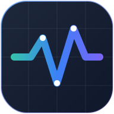
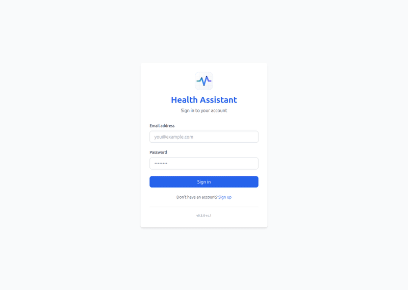
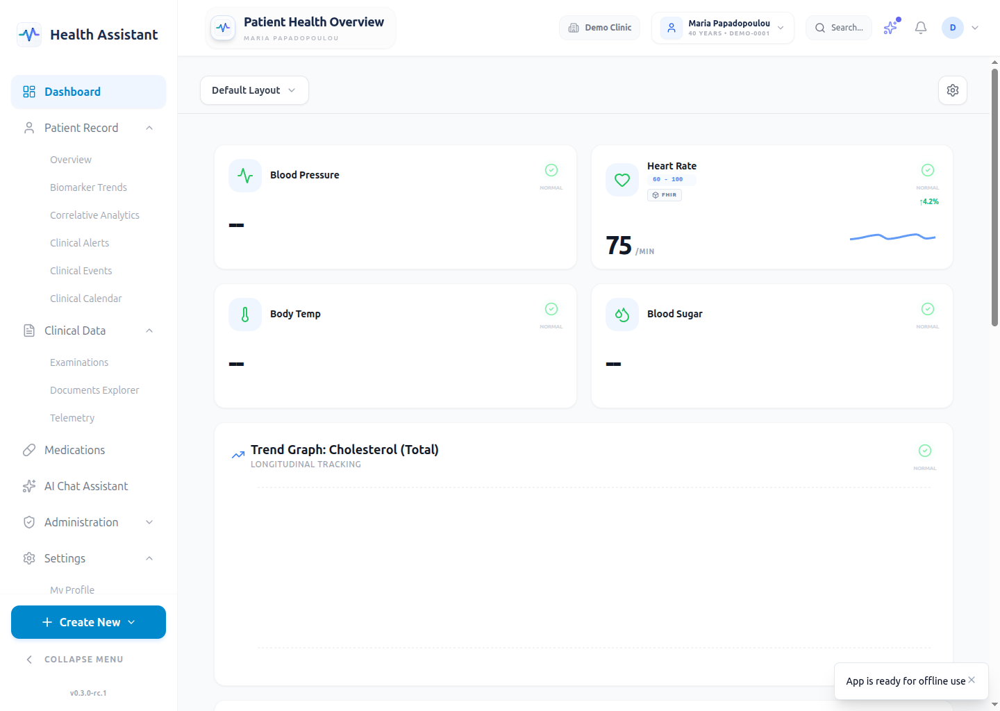
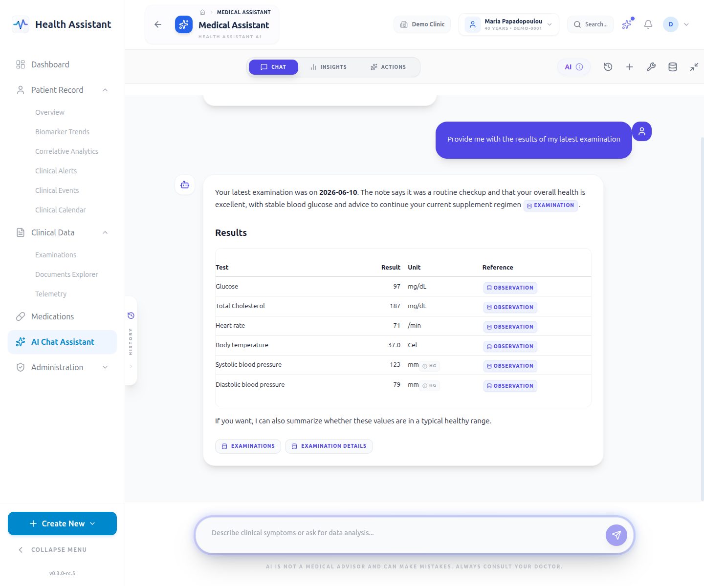
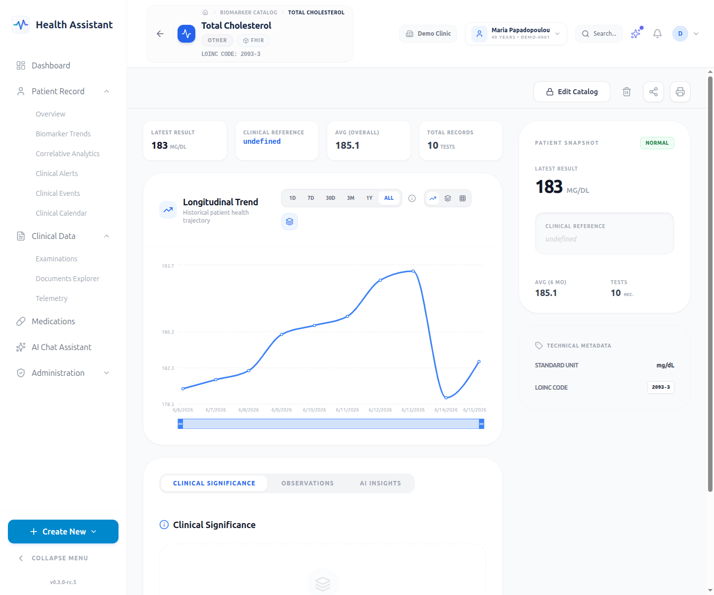
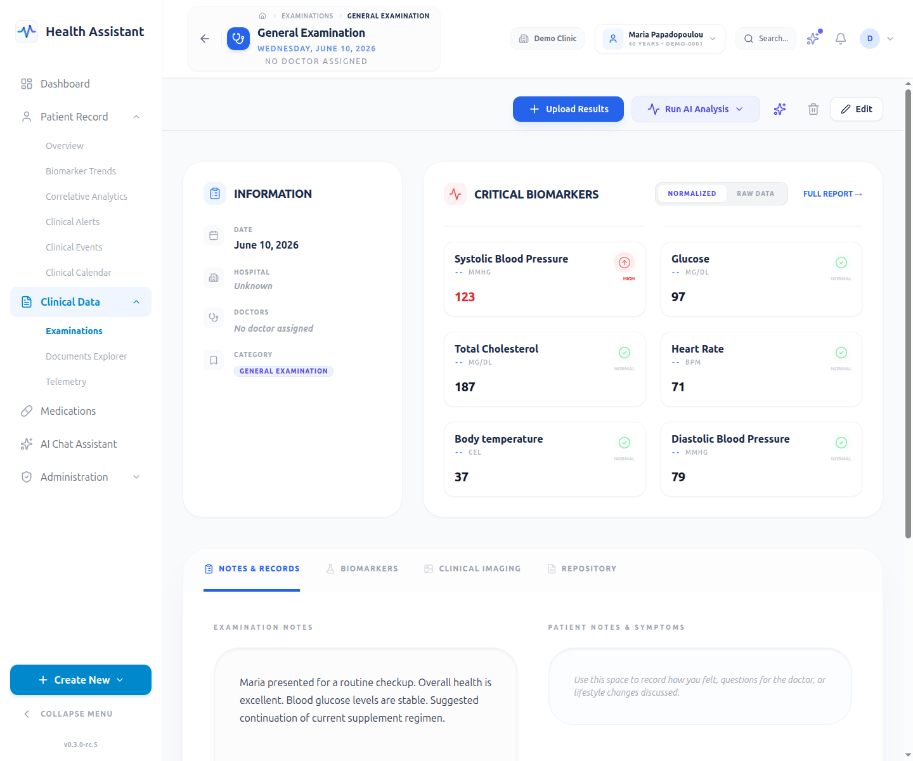
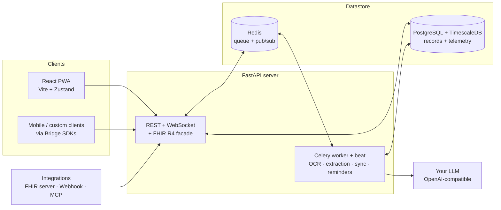

<div align="center">



# Health Assistant
### Self-hosted, privacy-first health records

[](https://github.com/health-assistant-io/health-assistant/releases)
[](#scope--limitations)
[](LICENSE)
[](#quick-start)
[](https://fastapi.tiangolo.com/)
[](https://react.dev/)
[](https://www.docker.com/)

<br>

<a href="docs/SCREENSHOTS.md">
  
</a>

<br>

**Website**: [health-assistant.io](https://health-assistant.io) · **Repository**: [health-assistant-io/health-assistant](https://github.com/health-assistant-io/health-assistant)

</div>

> **Independent project.** Health Assistant is inspired by the privacy-first, local-control philosophy of Home Assistant. It is not affiliated with, endorsed by, or connected to Home Assistant or Nabu Casa.

---

## Table of contents

- [What is Health Assistant?](#what-is-health-assistant)
- [What's different](#whats-different)
- [Features](#features)
- [Clinic-compatible by design](#clinic-compatible-by-design)
- [Visual tour](#visual-tour)
- [Quick start](#quick-start)
- [Architecture at a glance](#architecture-at-a-glance)
- [Documentation](#documentation)
- [Tech stack](#tech-stack)
- [Scope & limitations](#scope--limitations)
- [Status & roadmap](#status--roadmap)
- [Contributing](#contributing)
- [Support the project](#support-the-project)
- [License](#license)
- [Disclaimer](#disclaimer)

---

## What is Health Assistant?

A self-hosted web app for centralizing the health data you care about — lab results, doctor visits, medications, wearable data, and the notes in between. You run it on your own infrastructure, so the data never leaves your servers unless you say so.

Under the hood it's built on the same **HL7 FHIR** standard hospitals use, with a biomarker engine that normalizes your results across labs and a time-series store for device data. The everyday experience stays simple — but the foundation is there if you ever want to connect to a clinic, pull records from a hospital, or scale the same install into something clinic-grade.

It is **Beta** software, built for self-hosters and technical users first.

## What's different

- **Your data stays on your infrastructure.** No cloud lock-in, no third-party data resale. The database, uploaded files, and task queue all live wherever you deploy them.
- **Understand your results, not just store them.** Labs from different providers are normalized to common units and scored against reference ranges, so trends stay comparable over time. The AI assistant explains results in plain language.
- **The AI assists — it never writes your record.** The chat assistant proposes actions (track a new journey, add a medication, define a biomarker); you review and approve every single write through a structural human-in-the-loop wall.
- **Grows with you.** Today it serves a single user or a small group; the FHIR-native, multi-tenant foundation means the same installation can scale into a clinic-grade record without a rewrite.

## Features

### Bring all your health data together

- **Upload anything** — lab reports, doctor letters, imaging, discharge summaries. Snap a photo or drop a PDF; an OCR + AI pipeline extracts the structured data (biomarkers, medications, findings) for you.
- **Examinations** group every clinical visit: the documents, your notes, and the biomarker results, all in one place.
- **Medications, allergies, and vaccinations** tracked per person, each with its own reference catalog.
- **Rich-text / Markdown notes** per examination — your words, formatted your way.

### Understand your results

- **Biomarker trends over time** — cholesterol, glucose, thyroid, vitamins, anything you've had tested, charted longitudinally with normal/abnormal flagging.
- **Normalized across labs** — results from different providers auto-convert to a common unit, so your trend line stays meaningful even when you switch labs.
- **Relative score** — each result is positioned inside its reference range (0.0–1.0), giving you a lab-agnostic sense of where you sit.
- **An AI assistant that explains things** — ask "what does this result mean?" or "how has my cholesterol changed?" and get an answer grounded in your own data, with citations back to the source.

### Track the long view

- **Health journeys** — a pregnancy, a chronic condition, a surgical recovery, a weight-loss effort. Journeys span multiple visits, carry their own custom fields (trimester, pain intensity, dose), and link back to the examinations that fed them.
- **Wearable & device data** — heart rate, steps, continuous glucose, sleep. High-frequency data goes into a dedicated time-series store (TimescaleDB) so it doesn't bloat your clinical records, with smart downsampling that preserves spikes on the dashboard.
- **Reminders & alerts** — medication and follow-up reminders, plus alerts when a new result falls outside its reference range.

### An AI assistant that helps — carefully

- **Grounded in your data** — the assistant answers using your biomarker history, medications, documents, and catalog. It cites what it's drawing from.
- **Proposes, never writes** — it can suggest "track this as a new journey", "add this medication", or "define this biomarker". A review card opens; you edit and approve. Every write goes through the same REST endpoint a manual action would. **The AI cannot edit your clinical record directly.**
- **Bring your own LLM** — any OpenAI-compatible provider works: OpenAI, a local model via vLLM or Ollama, a self-hosted gateway. Configure per instance.
- **Magic Fill** — paste discharge notes or lab text; the assistant maps it into structured examination records for you to confirm.

### Private by default

- **Self-hosted** — the database, object storage, and queue live on your infrastructure. Nothing phones home.
- **No accounts to create with us** — you run it; you manage the users.
- **Encrypted AI keys** — your LLM API key is Fernet-encrypted at rest and masked in every response.
- **Prompt-injection screening** on all AI input, and an audit log on every clinical write.

### For multiple people

- **Multi-person records** under one installation — yourself and the other people you track.
- **Role-based access** — an admin manages everyone's records; each person can have a scoped view of their own.
- **Smart patient-context switching** — the whole UI refocuses on the selected person.
- **Multi-tenant under the hood** — today that means "one install per tenant"; tomorrow the same isolation can serve "one install per clinic, separated per department".

### Make it yours

- **Installable PWA** — add it to your phone or desktop, works offline, supports push notifications.
- **Draggable dashboard** — arrange the cards (trend charts, imaging previews, reminders) per person and save the layout.
- **Secure full-screen viewers** for images, PDFs, and Markdown documents.
- **Languages** — English and Greek.

### Connect your tools

- **Webhook** — receive data from any app or custom script via HTTP POST (HMAC-verified).
- **Bridge SDKs** (Python + TypeScript) — connect a mobile app or any custom client.
- **FHIR Server sync** — pull records from a hospital or personal-health-record that supports SMART-on-FHIR.
- **MCP client** — expose external Model Context Protocol tool servers to the AI assistant.
- **Build your own** with the Integrations SDK (`BaseHealthProvider`, `BaseConfigFlow`, `ObservationBuilder`) — connection pooling, rate-limit handling, cursor-based delta sync, and OAuth2+PKCE included.

## Clinic-compatible by design

Health Assistant is self-hosted and privacy-first. But the foundation is the same one hospitals use, so the same installation can grow into a clinic-grade record — or interoperate with one — without a rewrite. You don't need to care about any of this for everyday use; it's here for when you do.

- **HL7 FHIR R4 storage** — clinical data is stored as FHIR-enhanced relational rows and validated on write, so invalid FHIR never lands in the database.
- **FHIR R4 server facade** — a conformant REST API at `/api/v1/fhir/R4/*` exposes **18 resources** (Patient, Observation, Condition, Encounter, AllergyIntolerance, MedicationStatement, MedicationRequest, Medication, Immunization, DiagnosticReport, DocumentReference, Device, Communication, Organization, Practitioner, Provenance, CodeSystem, ValueSet) with CapabilityStatement, search Bundles, pagination, Provenance-on-write, and soft-delete tombstones.
- **Unified clinical catalogs** — biomarkers, medications, allergies, vaccines, anatomy, and a taxonomy/knowledge graph (25 relation types) with recursive multi-hop traversal.
- **Hard multi-tenant isolation** — every query is tenant-scoped; cross-tenant access is impossible.
- **Role-based access control** — four roles: System Admin, Admin, Manager, User.
- **Export & import** — FHIR R4B Bundle + BagIt-style ZIP backups at patient/group/system scope, with SHA256 manifest verification and cross-tenant id remapping on restore.
- **Audit provenance** — every clinical create/delete records who, what, and when.

External terminology code sets (LOINC, SNOMED CT, ICD-10, ATC, CVX) are used in the seed catalogs under their respective licenses — see [NOTICE](NOTICE) for the per-system terms and the SNOMED country-availability note.

## Visual tour

Reproducible screenshots captured against a seeded clinical dataset — see the [full visual tour](docs/SCREENSHOTS.md).

<table>
  <tr>
    <td width="50%" align="center"><a href="docs/images/dashboard-desktop.png"><br/><sub>Draggable dashboard</sub></a></td>
    <td width="50%" align="center"><a href="docs/images/ai-chat-desktop.png"><br/><sub>AI chat with review cards</sub></a></td>
  </tr>
  <tr>
    <td width="50%" align="center"><a href="docs/images/biomarker-detail-desktop.png"><br/><sub>Longitudinal biomarker trends</sub></a></td>
    <td width="50%" align="center"><a href="docs/images/examination-detail-desktop.png"><br/><sub>Examination with linked journeys</sub></a></td>
  </tr>
</table>

## Quick start

### Production (Docker, recommended)

```bash
git clone https://github.com/health-assistant-io/health-assistant.git
cd health-assistant
python scripts/setup_env.py          # generates SECRET_KEY, Fernet key, POSTGRES_PASSWORD, VAPID pair
docker compose --env-file .env -f docker/docker-compose.standalone.yml up -d
```

Create your initial admin:

```bash
docker compose --env-file .env -f docker/docker-compose.standalone.yml exec backend \
  python scripts/create_system_admin.py --email admin@example.com --password 'securepassword' --tenant "My Household"
```

The standalone compose file ships a built-in Nginx on port 80. If you already run a reverse proxy (Traefik/Nginx/Caddy), use `docker/docker-compose.prod.yml` instead. Full details in the [Installation Guide](docs/INSTALL.md).

### Development

```bash
./scripts/run-dev.sh                  # venv, deps, migrations, then honcho (backend + worker + beat + flower + frontend)
```

Frontend: http://localhost:3000 · API docs: http://localhost:8000/docs · Flower: http://localhost:5555

### Prerequisites

- **Docker** and Docker Compose (production) or **Python 3.12+ / Node 20+** (development).
- **PostgreSQL with the TimescaleDB extension** is required — a plain Postgres will crash on the telemetry hypertable migration. The Docker compose files include a compatible image.
- **An OpenAI-compatible LLM provider** (API key + endpoint) for OCR, document extraction, and the chat assistant. Configure it in `/settings/ai-config` or via env vars. The app works without one — you just lose the AI features.
- **Redis** for the task queue (included in the compose files).

## Architecture at a glance



The frontend talks to **domain endpoints** optimized for the UI. External systems (a hospital's FHIR server, a webhook sender) talk to the **FHIR R4 facade**. Both surfaces sit on the same FHIR-enhanced relational tables — there is no dual-write.

Background work (document OCR/extraction, integration sync, reminders, alert checks) runs in a separate Celery process coordinated through Redis; the FastAPI process does not run background jobs itself.

Deep dive: [ARCHITECTURE.md](docs/ARCHITECTURE.md).

## Documentation

**Getting started**
- [Visual Tour](docs/SCREENSHOTS.md) — every page, reproducible screenshots
- [Installation Guide](docs/INSTALL.md) — Docker, manual setup, prod security checklist, nginx, troubleshooting
- [Architecture Overview](docs/ARCHITECTURE.md) — tech stack, DB schema, biomarker engine, AI pipeline

**Everyday use & core systems**
- [User Management & Tenancy](docs/TENANCY_AND_USER_MANAGEMENT.md) — tenants, roles, identity ↔ record linking
- [Ontology & Catalog](docs/ONTOLOGY_CATALOG.md) — how incoming data maps to your catalog
- [Taxonomy & Knowledge Graph](docs/TAXONOMY.md) — concepts, edges, cross-domain traversal
- [Notification System](docs/NOTIFICATION_SYSTEM.md) — reminders, alerts, Web Push
- [Telemetry & Aggregation](docs/TELEMETRY_AND_AGGREGATION.md) — wearable data, downsampling
- [Export & Import (Backup)](docs/EXPORT_IMPORT.md) — FHIR Bundle + ZIP, SHA256 manifest

**AI**
- [AI System & Configuration](docs/AI_SYSTEM.md) — provider setup, chatbot, human-in-the-loop proposals

**Integrations & API**
- [REST API Reference](docs/API.md) · [FHIR R4 Facade](docs/FHIR_R4_FACADE.md)
- [Integrations Framework](docs/INTEGRATIONS_FRAMEWORK.md) · [Integrations SDK](docs/INTEGRATIONS_SDK.md)
- [Mobile Sync App](docs/MOBILE_SYNC_APP.md) — headless companion architecture

**Development & operations**
- [Development Guide](docs/DEVELOPMENT.md) · [CI/CD Deployment](docs/CI_CD_SETUP.md) · [Release Process](docs/RELEASE_PROCESS.md)
- [Seeding & Demos](docs/SEEDING_AND_DEMOS.md) · [Task Debugging Guide](docs/TASK_DEBUGGING_GUIDE.md)

**Project status**
- [Current Status](docs/STATUS.md) · [Development Roadmap](docs/DEVELOPMENT_PLAN.md)

Interactive API docs are also available at `/docs` on a running backend.

## Tech stack

| Layer | Technology |
|---|---|
| Backend | FastAPI (Python 3.12+), async, SQLAlchemy 2.0 (`asyncpg`), Pydantic v2 |
| Frontend | React 18 + Vite 5 + TypeScript 5.3 (strict) + Tailwind 3.4 |
| State | Zustand 4 (slices, some persisted) |
| Database | PostgreSQL + TimescaleDB (required) |
| Cache / Queue | Redis + Celery (JSON serializer, UTC, per-task event loops) |
| Migrations | Alembic (sync `psycopg2` engine; 51+ migrations) |
| AI / NLP | LangChain unified factory, OpenAI-compatible (`langchain_openai.ChatOpenAI`), spaCy fallback |
| Container | Docker + Docker Compose |
| PWA | vite-plugin-pwa (injectManifest), Web Push (VAPID), Dexie offline cache |
| Charts / UI | recharts, react-grid-layout, lucide-react, react-markdown, i18next (en/el) |

## Scope & limitations

Health Assistant is **Beta** (`0.3.x`). The points below are honest boundaries — not every limitation is a bug.

- **Pre-1.0 APIs.** REST endpoints, DB schemas, and FHIR projections may change before `1.0`. Pin a version for production deployments.
- **Self-hosted only.** There is no managed/cloud hosted offering. You run it on Linux via Docker. No native Windows or macOS desktop installers.
- **TimescaleDB is mandatory.** A plain Postgres will crash on the telemetry hypertable migration. Use the bundled compose image or install the extension.
- **Celery is a separate process.** The FastAPI process does not run background jobs. If you run `uvicorn` standalone, document extraction, reminders, and integration sync will queue silently in Redis. The provided compose files and `run-dev.sh` start them together.
- **AI features need an external LLM.** OCR, document extraction, and the chat assistant call an OpenAI-compatible endpoint you provide (OpenAI, vLLM, Ollama, etc.). The rest of the app works without one.
- **Wearable data is one-directional so far.** High-frequency telemetry (heart rate, steps, CGM) is stored and charted, but there is no first-party phone app yet — data arrives via the webhook, bridge SDK, or a FHIR server integration. A headless mobile companion is on the roadmap.
- **Notification channels.** In-app (WebSocket) and Web Push (VAPID) are fully implemented. Email and SMS are stubbed.
- **FHIR coverage.** 18 R4 resources are exposed on the facade (not the full spec). `_format=xml`, transaction/batch Bundle processing, and `POST /_search` are roadmap. Telemetry data is stored outside strict FHIR (performance tradeoff) and excluded from FHIR exports.
- **Test coverage.** The backend has 830+ pytest tests; the frontend has sparse co-located vitest tests; there is no end-to-end suite yet.
- **No medical certification.** This software is not certified for clinical use, is not HIPAA/GDPR-certified, and must not be relied upon for diagnosis or treatment decisions (see [Disclaimer](#disclaimer)).

## Status & roadmap

A few headline items from [STATUS.md](docs/STATUS.md) and [DEVELOPMENT_PLAN.md](docs/DEVELOPMENT_PLAN.md):

- **Mobile companion** — headless app bridging Android Health Connect / iOS HealthKit directly to your instance.
- **Biomarker insights** — deeper trend analytics, organ/symptom correlations, contextual "why does this matter?" explanations.
- **Advanced FHIR R4 conformance** — `_format=xml`, transaction/batch Bundle processing, `POST /_search` (for clinic interop).
- **End-to-end test suite** — Playwright or Cypress covering the document → extraction → biomarker pipeline.

Already shipped recently: unified catalog registry with ownership-based access, cross-catalog knowledge graph, hybrid (trigram + FTS + RRF) search, FHIR R4 facade Stage 3, human-in-the-loop proposals with auto-resume, and a unified notifications system.

## Contributing

Contributions are welcome. To set up a working dev environment, follow [Quick start → Development](#quick-start) and read the [Development Guide](docs/DEVELOPMENT.md) for code style, testing, and the versioning workflow.

For backend changes, run `ruff check` / `ruff format` and the pytest suite (`cd backend && ./run-tests.sh`) before submitting. For frontend changes, `npm run build` (tsc strict + vite) and `npm run lint` must pass.

## Support the project

If Health Assistant has helped you take control of your health data, or if you believe privacy-first health infrastructure should exist, please consider supporting continued development and maintenance.

[](https://buymeacoffee.com/healthassistant)

## License

Apache License 2.0 — see [LICENSE](LICENSE) and [NOTICE](NOTICE) for details. Third-party assets (anatomy surface diagrams, CC BY-SA 3.0) and clinical terminology code sets (LOINC, SNOMED CT, ICD-10, ATC, CVX) are used under their respective licenses — see NOTICE for the per-system terms and the SNOMED country-availability note.

## Disclaimer

This software, including its AI chatbot and agentic features that may offer health-related information, guidance, or medication explanations, is for informational and wellness purposes only. It does **not** provide medical diagnosis and is not a substitute for professional medical care. Always consult qualified medical professionals for health advice, diagnoses, or before making any medical decisions based on the software's output.
