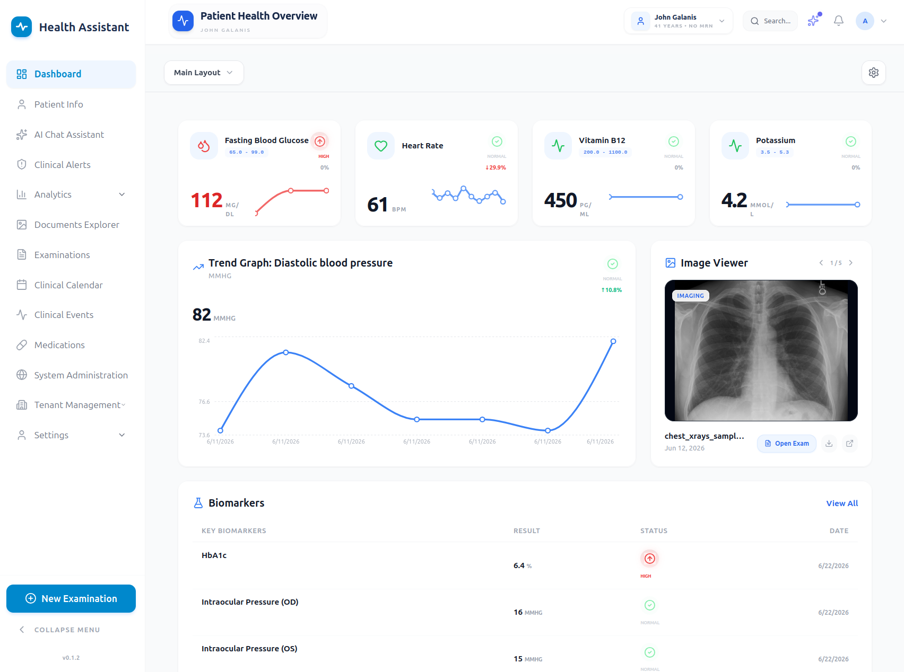

# Health Assistant
### Universal Health Data Platform

[](https://github.com/health-assistant-io/health-assistant/releases)
[](#)
[](LICENSE)
[](#)
[](https://fastapi.tiangolo.com/)
[](https://reactjs.org/)
[](https://www.docker.com/)
[](https://github.com/sponsors/health-assistant-io)

<p align="center">
  
</p>

**Official Website**: [health-assistant.io](https://health-assistant.io)  
**GitHub**: [health-assistant-io/health-assistant](https://github.com/health-assistant-io/health-assistant)

A self-hosted, privacy-first web application for centralizing, monitoring, and analyzing health and wellness data using open healthcare standards.


> **Note:** Health Assistant is an independent, open-source project inspired by the privacy-first, local-control philosophy of Home Assistant. It is not affiliated with, endorsed by, or connected to Home Assistant or Nabu Casa.

> **Development Status:** This project is currently in **Beta**. The core platform is fully functional, featuring AI-powered OCR, dynamic visualizers, and multi-tenant patient management, but is still undergoing active development.

## 💖 Support the Project

If Health Assistant has helped you take control of your health data, or if you believe in privacy-first healthcare infrastructure, please consider supporting the project.

Your sponsorship directly supports the continued development, maintenance, and improvement of the platform.

[Sponsor on GitHub](https://github.com/sponsors/health-assistant-io)

## 📖 Documentation

- [Technical Architecture](./docs/ARCHITECTURE.md)
- [AI System & Extensibility](./docs/AI_SYSTEM.md)
- [Integrations SDK & Developer Guide](./docs/INTEGRATIONS_SDK.md)
- [Development Guide](./docs/DEVELOPMENT.md)
- [CI/CD Deployment & Setup](./docs/CI_CD_SETUP.md)
- [API Documentation](http://localhost:8000/docs)

For a detailed breakdown of the codebase, see the [Project Structure](./docs/PROJECT_STRUCTURE.md) document.

## Key Features

- **Multi-Tenancy & Household-Ready**: Zero-config setup for home users. The first user becomes the System Admin, and households are auto-provisioned upon registration.
- **Data Sovereignty & No Vendor Lock-in**: Perfect for healthcare startups and clinics. Deploy Health-Assistant on your own HIPAA-compliant infrastructure. You own the code and the data, avoiding the trap of BAA-locked proprietary platforms.
- **Identity & Record Linking**: Seamlessly link login accounts to clinical Patient or Doctor records, perfect for individual users managing their own family's health.
- **HL7 FHIR Standard**: Full compliance with Fast Healthcare Interoperability Resources, including validated-on-write storage (invalid FHIR is rejected at the API) and a dedicated **FHIR Server** integration that connects to external hospital/health-record systems via SMART-on-FHIR.
- **Examinations Platform**: Native grouping of medical documents, clinical notes (Rich-Text/Markdown), and analytics exclusively by distinct clinical visits.
- **Clinical Events & Longitudinal Tracking**: Specialized system for tracking clinical events like pregnancies, chronic pain, or surgical recoveries. Features a **Metadata-Driven Architecture** allowing for dynamic, specialty-specific fields and categorized filtering.
- **Bi-directional Visit Mapping**: Seamlessly link examinations to clinical events with specific clinical reasons. Associations can be managed directly from the Examination preview or detail pages.
- **Clinical Dashboard**: Global and patient-specific views of long-term medical events.
- **Unified AI Architecture & Agentic Chatbot**: Provider-agnostic AI factory supporting OpenAI, Anthropic, and Local LLMs via LangChain. Configure models per task type and tenant. Features an advanced, context-aware **AI Assistant** that acts as an agentic chatbot. It is equipped with tools to fetch biomarker history, explain complex medications, query raw document contents, and provide interactive clinical insights.
- **AI-Powered "Magic Fill" & Copilot**: Specialized AI workflows that auto-generate clinical biomarker and medication definitions, generate custom SVG UI icons, and provide a "Magic Fill" capability to instantly map unstructured text into structured examination records.
- **Dynamic Category Visualizations**: Auto-tagging mechanism routing processed results directly to specialized Clinical Components (Lab Results, Imaging Gallery, Procedure Reports).
- **Patient Context Control**: Robust top-level tracking system controlling the flow of views and data filtering across the entire application.
- **TimescaleDB**: Native time-series support for tracking patient biomarker progression over time.
- **Pluggable Integration Framework & SDK**: A modular system for connecting third-party platforms (wearables, labs, webhooks, and **cloud OAuth sources via SMART-on-FHIR with Dynamic Client Registration**) with a schema-driven UI and automated background syncing. Includes a dedicated **Integrations SDK** for developers to rapidly build custom data providers with built-in connection pooling, rate limit handling, cursor-based delta syncing, and reusable OAuth2+PKCE auth.
- **Async Processing**: Fast background tasks powered by Redis + Celery.

## Quick Start

```bash
./scripts/run-dev.sh
```

For manual setup and production deployment, please see the [Installation Guide](./docs/INSTALL.md).
For developers, refer to the [Development Guide](./docs/DEVELOPMENT.md).

## License

Apache License 2.0 - See LICENSE file for details.

## Disclaimer

This software, including its AI chatbot and agentic features that may offer health-related information, guidance, or medication explanations, is for informational and wellness purposes only. It does NOT provide medical diagnosis or act as a substitute for professional medical care. Always consult certified medical professionals for health advice, diagnoses, or before making any medical decisions based on the software's outputs.