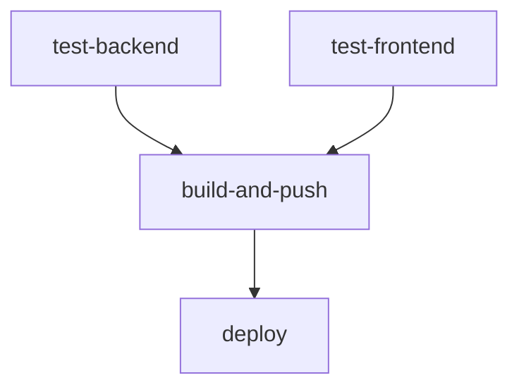

# Health Assistant — CI/CD Pipeline Setup

How the project's continuous integration and delivery work: what runs on the public GitHub mirror, and the reference self-hosted Gitea pipeline that deploys a real instance.

---

## 1. GitHub workflows (public mirror)

Every push to `main` on GitHub runs the workflows in `.github/workflows/`:

| Workflow | What it does |
|---|---|
| **Test suite** (`test.yml`, reusable) | Backend pytest (Python 3.12, Postgres + Redis service containers) + frontend lint & build. |
| **Docker Build and Publish** (`docker-publish.yml`) | Builds backend + frontend images and publishes them to `ghcr.io` on `main` and semver tags. |
| **Create GitHub Release** (`release.yml`) | On `vX.Y.Z` tags: creates a GitHub Release with notes extracted from the matching `CHANGELOG.md` section. |
| **Security Scan** (`security-scan.yml`) | Dependency vulnerability scanning on `main` and PRs. |
| **BYOK setup contract** / **AI architecture alignment** / **Cross-repo conventions** | Contract gates (`byok-contract.yml`, `ai-alignment.yml`, `family-convergence.yml`): the one-click AI provider setup contract, AI architecture rules, and shared conventions. |

Releases are cut with `scripts/version_manager.py` — see the changelog-first flow in `CHANGELOG.md`; images and GitHub Releases publish only when a release is explicitly pushed.

---

## 2. The self-hosted Gitea deploy pipeline (reference topology)

The same repository is mirrored to a self-hosted Gitea instance, where `.gitea/workflows/deploy.yml` builds and deploys a real instance on every push to `main` (a separate `test` branch deploys a fully isolated stack on the same host). Five stages:



1. **`test-backend`** — starts Postgres (TimescaleDB) and Redis via `docker run` on the job's own network (the runner's `services:` DNS aliases are unreliable, so siblings are started explicitly with `--network-alias`), installs dependencies with **uv** (`uv sync --frozen`), and runs the pytest suite.
2. **`test-frontend`** — `npm ci`, lint, and a production build check.
3. **`build-and-push`** — builds both images with the host's Docker daemon and pushes them to the Gitea container registry (floating tag `latest`/`test` + the commit SHA).
4. **`deploy`** — SSHes to the target server, writes `.env` from repo secrets, copies `docker-compose.standalone.yml` + DB init scripts, runs a PG-major pre-flight on the existing data volume, brings the stack up, and runs `alembic upgrade head`.
5. The standalone stack exposes a single published port — the bundled nginx gateway (`${HTTP_PORT:-80}`) — which also routes Flower at `/flower/` behind basic auth. Backend/frontend/Flower ports are bound to loopback only.

### Required Gitea repository secrets

| Secret | Description |
| :--- | :--- |
| **`REGISTRY_HOST`** | Registry domain without protocol or trailing slash. |
| **`REGISTRY_TOKEN`** | PAT with `write:packages` / `read:packages`. |
| **`VM_HOST`** / **`VM_PORT`** | Deploy target host + SSH port. |
| **`SSH_PRIVATE_KEY`** | SSH key authorized for the `deploy` user. |
| **`APP_URL`** | Canonical public origin (drives CORS, TrustedHost, OAuth issuer). Optional: `FRONTEND_URL`, `HTTP_PORT` for front-proxy topologies. |
| **`HA_SESSION_KEY`** / **`HA_REFRESH_KEY`** / **`HA_DATA_KEY`** | Per-purpose signing + at-rest keys (independent values; see the install security checklist). Optional `HA_DATA_KEY_PREVIOUS` for rotation. |
| **`POSTGRES_DB`** / **`POSTGRES_USER`** / **`POSTGRES_PASSWORD`** | Database name, owner role, password. |
| **`REDIS_PASSWORD`** | Required — Redis runs with `requirepass`. |
| **`FLOWER_USER`** / **`FLOWER_PASSWORD`** | Flower basic auth. |
| **`VAPID_PUBLIC_KEY`** / **`VAPID_PRIVATE_KEY`** / **`VAPID_ADMIN_EMAIL`** | Web Push (required in production). |
| **`HA_TRUSTED_PROXY_COUNT`** | Reverse-proxy hops for rate-limit identity (default `1`). |
| **`OPENAI_API_KEY`** *(optional)* + `OPENAI_API_BASE` / `OPENAI_MODEL` / `OCR_PROVIDER` | Default AI provider for OCR/extraction. |
| **`SMTP_*`** *(optional)* | Outbound mail. |
| **`TEST_*`** *(optional)* | Per-branch overrides for the isolated test stack (deploy path, ports). |

---

## 3. Self-hosted runner configuration (`config.yaml`)

### A. Pin the runner image to Docker Hub & enable concurrency

By default the runner pulls job containers from `docker.gitea.com/runner-images`, which times out from some networks. Map the `runs-on` labels to the identical image mirrored on Docker Hub and set job capacity:

```yaml
runner:
  capacity: 2  # lets test-backend and test-frontend run at the same time
  labels:
    - "ubuntu-latest:docker://gitea/runner-images:ubuntu-latest"
    - "ubuntu-22.04:docker://gitea/runner-images:ubuntu-latest"
    - "ubuntu-24.04:docker://gitea/runner-images:ubuntu-latest"
```

Edit the `config.yaml` mounted into your runner container, restart it, and pre-pull once so the first job isn't gated on the registry. The deploy workflow also pins the image per-job via `container:` blocks, so it keeps working even before this runner-side change (defense in depth).

### B. Network & sibling container DNS resolution

So spawned job containers resolve your local domain names without timeout errors:

```yaml
container:
  network: "gitea-runner_default"  # the Docker network of your runner container
  options: "--add-host=gitea.example.com:host-gateway"  # your Gitea domain
```

### C. Enable actions caching (setup steps drop from minutes to seconds)

```yaml
cache:
  enabled: true
  host: "runner"  # matches the service name in the runner's docker-compose
```

---

## 4. Reverse proxy (nginx) requirements for large image pushes

If Gitea runs behind nginx, disable request buffering and raise timeouts, or large Docker layers fail to push:

```nginx
location / {
    client_max_body_size 512M;
    proxy_request_buffering off;
    proxy_buffering off;
    proxy_read_timeout 600s;
    proxy_connect_timeout 600s;
    proxy_send_timeout 600s;
}
```

Reload nginx after saving: `docker compose exec nginx nginx -s reload`.

---

## See also

- [Installation Guide](./INSTALL.md) — deployment flavors (standalone vs. bring-your-own-proxy), the security checklist, first-run seeding, and updates.
- [Development Guide](./DEVELOPMENT.md) — running the test suite locally.
