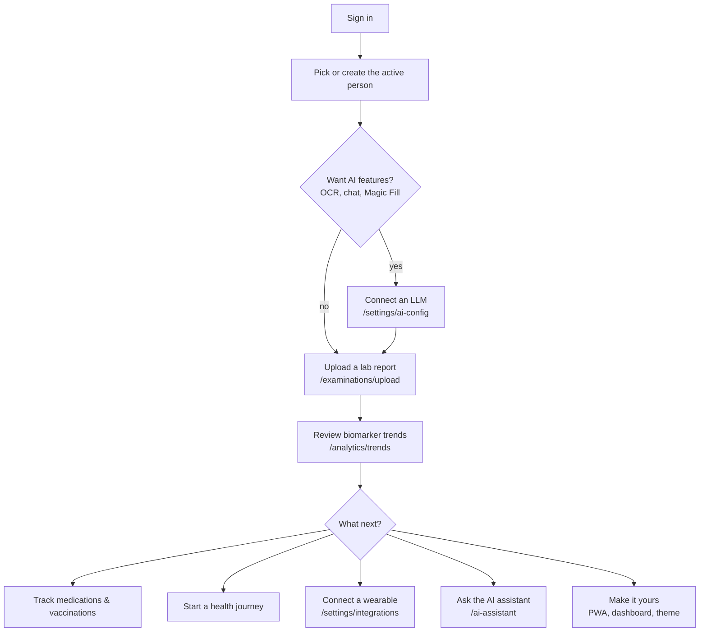
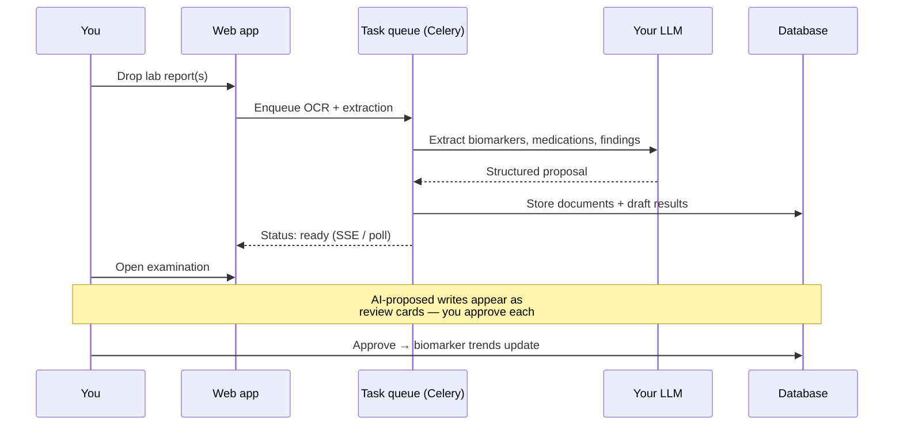

# Getting Started Guide

Health Assistant is a self-hosted, open-source health records platform.
This guide takes you from a fresh login to a working record in about an
hour: add the first person, upload a lab report, read your biomarker
trends, and — if you want AI features — connect an LLM. It assumes
someone has already installed the app; if not, start with the
[Installation Guide](./INSTALL.md).

You don't have to do all of this. The app is fully usable for manual
record-keeping without an LLM or any integration — you just skip the
AI-assisted steps.

---

## 1. Sign in

Open the app URL your installer gave you (typically
[http://localhost](http://localhost) for a local Docker install).

- **First time here?** A fresh install detects that no admin exists and
  redirects you to a **setup wizard** instead of the login screen. Pick
  the admin email, password, and organization name there — you choose
  them, there are no defaults. (If you're accessing remotely, the wizard
  asks for a one-time *setup token* printed in the backend container
  logs, so a stranger can't claim your instance before you do.)
- **Returning?** Sign in with the email and password you set up during
  first-run.

After login you land on the **Dashboard**, a drag-and-drop grid of cards
you can rearrange per person (trends, reminders, imaging previews).

> **Roles in one line.** `SYSTEM_ADMIN` runs the whole install;
> `ADMIN` runs a tenant; `MANAGER` and `USER` get progressively narrower
> views. Most of this guide assumes you're an admin on a personal
> install — the only things you can't do at lower roles are hidden from
> the UI automatically.

---

## 2. Pick — or create — the active person

Health Assistant organizes everything **per person**. The header has a
person switcher; the entire UI refocuses on whoever is selected.

- **To switch:** use the person picker in the top bar.
- **To create the first person:** open the **Create** menu (bottom of
  the sidebar) → **New patient**, or go to **Patients** (`/patients`)
  and add one. Fill in at least the name and date of birth.
- **To track yourself:** create a patient record for yourself, then have
  an admin **link it to your user account** (a Patient record's
  `user_id` is set by an admin). Once linked, the app auto-selects you
  on login. You can see which records are linked to you on
  **Profile** (`/profile`) under "Your Linked Records".

Many pages show an empty state until a person is selected — that's
normal. Pick a person first.

---

## 3. Optional: connect an LLM (for OCR, chat, and Magic Fill)

The app works without any AI — you'd just type everything by hand. To
turn on document extraction, the chat assistant, and Magic Fill, connect
an **OpenAI-compatible** LLM provider (OpenAI itself, a local model via
vLLM/Ollama, or a self-hosted gateway).

1. Go to **Settings → AI Configuration** (`/settings/ai-config`).
2. On the **Providers** tab, add a provider: name, base URL, and your
   API key. The key is Fernet-encrypted at rest and masked in every
   response.
3. On the **Models** tab, register the model IDs that provider offers
   (e.g. `gpt-4o-mini`).
4. On the **Task Assignments** tab, pick which model handles which task
   (OCR, structured extraction, chat). Defaults are sensible — you can
   leave them.

That's it. AI features are now live. If you skip this, the rest of this
guide still works; you'll just enter lab data manually instead of having
it extracted from a photo.

> **The AI never writes your record.** Every AI-proposed action — adding
> a medication, defining a biomarker, starting a journey — opens a
> review card. You edit and approve; only then does the write happen,
> through the same endpoint a manual action would use.

---

## 4. Upload a lab report

This is the fastest way to populate a record. Go to **Examinations →
Upload** (`/examinations/upload`) or use **Create → New examination**.

1. **Pick the person** (already set if you selected one in the header).
2. **Add files** — drag in a PDF, an image, or snap a photo. The page
   supports three modes:
   - **Single** — one examination, one or more attached files.
   - **Bulk** — several examinations at once, each with its own files.
   - **Smart** — many files auto-grouped into one examination.
3. **Set the basics** — date, category (e.g. *Clinical*, *Lab*),
   optionally the doctor and organization.
4. **Save.** Files upload and the backend queues an OCR + extraction
   task per file.

What happens next runs in the background:

When processing finishes:

- **Documents** (`/documents`) shows the uploaded files with previews.
- **Biomarkers** (`/analytics/trends`) charts any extracted lab results.
- The **Examination** detail page (`/examinations/:id`) groups the
  documents, your notes, and the linked biomarker results in one place.

You can watch live progress in **Task Manager** (`/task-monitor`) or the
Flower dashboard (`/flower/` on a Docker install).

---

## 5. Create an examination manually

An **examination** is the container for a clinical visit — its
documents, your notes, and the biomarker results that came out of it.
Even without a file upload you can create one:

1. **Create → New examination** (or a patient's detail page).
2. Set the date, category, and optionally the doctor/organization.
3. Write notes in the rich-text editor (Markdown supported).
4. Save. You can attach documents and link biomarkers to it later from
   the examination's detail page.

Examinations are the backbone of the timeline — health journeys and the
calendar both reference them.

---

## 6. Read your biomarker trends

Go to **Biomarkers** (`/analytics/trends`). Each row is a biomarker
(cholesterol, glucose, thyroid, vitamins — anything you've had tested)
charted over time. For each result you get:

- **Value + unit**, normalized across labs so switching providers
  doesn't break your trend line.
- **Normal/abnormal flagging** against the biomarker's reference range.
- **Relative score** (0.0–1.0) — where the result sits inside its
  reference range, lab-agnostic.

Click any biomarker to open its detail page (`/biomarkers/details/:id`)
for the full history, reference ranges, and source documents.
**Correlative Analytics** (`/analytics/correlative`) lets you overlay
trends to spot patterns (e.g. sleep vs. resting heart rate).

If a biomarker you need isn't in the default catalog, you can define it
manually from **Catalogs** (`/catalogs?type=biomarker`) — or ask the AI
assistant to propose one (which you then approve).

---

## 7. Track medications, vaccinations, and allergies

These live under **Patient Record → Treatments & Alerts** in the
sidebar, and are all per-person:

- **Medications** (`/medications`) — your prescriptions, each linked to
  a drug in the shared reference catalog.
- **Vaccinations** (`/vaccinations`) — doses, lot numbers, dates, linked
  to the vaccine catalog.
- **Allergy Alerts** (`/alerts`) — allergies and intolerances, surfaced
  on the dashboard.

There's a useful distinction: the **catalog** (`/catalogs`) is the
shared reference library of drugs, vaccines, biomarkers, etc., while the
items above are **your** instances of them. If a drug isn't in the
catalog yet, you can define it inline while adding a prescription.

---

## 8. Start a health journey

A **health journey** (clinical event) spans multiple visits and carries
its own custom fields — a pregnancy with trimester, a chronic condition
with pain intensity, a surgical recovery with dose. Go to
**Create → New clinical event** (or **Patient Record → Health Journeys**
at `/events`).

1. Pick a journey type (these come from a seeded catalog; you can add
   your own).
2. Set the dates and any custom fields the type defines.
3. Link the examinations that fed into it.

Journey detail pages (`/events/:id`) show the timeline of linked visits
and let you update the custom fields as the journey progresses.

---

## 9. Connect a wearable or other integration

Integrations are **per-person** — each person connects their own. Go to
**Settings → Integrations** (`/settings/integrations`) with a person
selected in the header.

- **Available** integrations are grouped by category (wearables, labs,
  webhooks, FHIR servers, bridges).
- Pick one and step through its **config flow** (OAuth2 for some, an
  API key or webhook URL for others).
- Once connected, it shows under **Active** and starts syncing on a
  schedule. High-frequency data (heart rate, steps, continuous glucose)
  goes into the time-series store so it doesn't bloat your clinical
  records.

You can also receive data from any custom script via the **webhook**
integration (HMAC-verified), or build your own with the
[Integrations SDK](./INTEGRATIONS_SDK.md).

---

## 10. Ask the AI assistant

Open **AI Assistant** (`/ai-assistant`). The assistant is **grounded in
your data** — it answers using your biomarker history, medications,
documents, and the catalog, and cites what it's drawing from.

Try things like:

- *"What does my latest cholesterol result mean?"*
- *"How has my vitamin D changed over the last year?"*
- *"Track this as a new journey"* — it proposes; you approve in a
  review card.
- *"Add this medication"* / *"define this biomarker"* — same
  propose-then-approve flow.

There's also **Magic Fill**: paste discharge notes or raw lab text into
an examination and the assistant maps it into structured fields for you
to confirm. It never writes directly — every proposal is a card you
review, edit, and approve.

---

## 11. Make it yours

- **Install as an app** — it's a PWA. Add it to your phone or desktop
  for a full-screen, offline-capable app with push notifications.
- **Rearrange the dashboard** — drag the cards (`/dashboard`) and save
  the layout per person.
- **Appearance** — `/settings/appearance` for theme and visualization
  options.
- **Notifications** — `/settings/notifications` for medication
  reminders, follow-ups, and out-of-range biomarker alerts.
- **Languages** — English and Greek, switchable in preferences.
- **Backups** — admins can export a FHIR R4B Bundle + ZIP from
  `/settings/export-import`.

---

## 12. Where to go next

- [Installation Guide](./INSTALL.md) — deploy or move to production.
- [Architecture Overview](./ARCHITECTURE.md) — tech stack, data model,
  biomarker engine, AI pipeline.
- [AI System & Configuration](./AI_SYSTEM.md) — providers, models, the
  agentic chat tools, per-tenant model config.
- [Integrations Framework](./INTEGRATIONS_FRAMEWORK.md) — wearables,
  labs, webhooks, FHIR server sync, MCP.
- [REST API Reference](./API.md) and [FHIR R4 Facade](./FHIR_R4_FACADE.md)
  — for building on top of Health Assistant.
- [Visual Tour](./SCREENSHOTS.md) — screenshots of every page.
