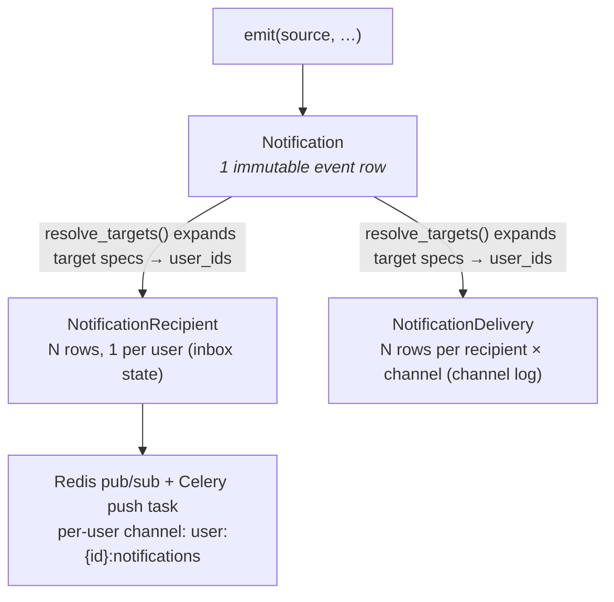

# Notification System

Health Assistant's unified notification platform is a multi-source, multi-recipient, multi-channel, role-aware system with real-time delivery. It is the single surface for every kind of notice the app produces — scheduled reminders, biomarker alerts, AI/HITL proposals, integration sync outcomes, clinical-event lifecycle, and admin broadcasts.

The system was unified in July 2026 (replacing the legacy single-table medication/exam reminder system). The legacy `alerts` module was removed; biomarker thresholds are now event-driven via `NotificationRule`s.

## Architecture — fan-out model

Canonical pattern (GitHub/Slack-style): separate **event** from **inbox state** from **channel delivery**.



### Three tables (`backend/app/models/notification.py`)

| Table | Purpose | Key columns |
|---|---|---|
| `notifications` | Immutable event row (1 per emit) | `source`, `type`, `category`, `severity`, `title`, `body`, `payload`, `patient_id?`, `tenant_id?`, `trigger_id?`, `communication_id?`, `sender_user_id?`, `dedup_key?`, `dedup_expires_at?` |
| `notification_recipients` | Inbox state (N rows, 1 per resolved user) | `user_id`, `recipient_kind`, `recipient_ref`, `status` (`unread`/`read`/`dismissed`), `read_at`, `dismissed_at`. Indexed `(user_id, status)` |
| `notification_deliveries` | Per-channel delivery log (N rows per recipient) | `user_id`, `channel` (`IN_APP`/`PUSH`/`EMAIL`/`SMS` — note: only `IN_APP` and `PUSH` are wired today; `EMAIL`/`SMS` are reserved enum values for future channels), `status` (`pending`/`sent`/`delivered`/`failed`), `attempted_at`, `delivered_at`, `error`, `subscription_id?` |

Two supporting tables:
- `notification_triggers` — TIME/RECURRING schedule rules (medication reminders, exam reminders). Same as before.
- `notification_subscriptions` — Web Push (VAPID) credentials per user.
- `notification_rules` (separate file `notification_rule.py`) — replaces the old `alerts` table. Event-driven biomarker threshold rules evaluated on observation ingestion.

## Sources

| Source (`NotificationSource`) | What triggers it | Category | Hook |
|---|---|---|---|
| `SCHEDULED` | Medication / exam reminder (`NotificationTrigger` fires via Celery beat) | `reminder` | `NotificationManager.fire_notification` → `emit` |
| `RULE` | Biomarker threshold crossed on observation ingestion | `alert` | `notification_rule_service.evaluate_and_fire` ← `fhir_service.create_observation` |
| `AGENT` | HITL proposal created by the AI agent | `hitl` | `_notify_hitl_proposal` helper in `ai/tools/hitl_proposals.py` (called from all 6 propose tools) |
| `INTEGRATION` | Wearable/lab sync outcome (baseline) **+ provider-authored rich events** (threshold alerts, HITL prompts, daily summaries, etc.) | `integration` / `alert` / `hitl` / `agent` / `system` | `_notify_sync_outcome` (baseline) + `_emit_provider_notifications` (opt-in via `supports_notifications`) — both called from `integration_sync_service.post_sync_notifications` after `run_sync` AND after webhook processing |
| `CLINICAL` | Clinical event created | `clinical_event` | `POST /clinical-events` → `emit` to the care team |
| `SYSTEM` | Admin broadcast (`POST /admin/notifications/broadcast`) | `system` | admin endpoint → `emit` with `TENANT` or `SYSTEM` targets |

## Integration-driven notifications (provider-opt-in)

Beyond the baseline "synced N records / sync failed" notification that fires for every integration, providers can emit rich, event-driven notifications by overriding SDK hooks on `BaseHealthProvider`. The pattern mirrors `supports_tools` / `get_tools` and `get_custom_actions` / `execute_custom_action` — safe defaults, opt-in override, no per-domain code in any endpoint.

| Hook | Default | When called |
|---|---|---|
| `supports_notifications() → bool` | `False` | Feature gate. Returning True opts the provider in. |
| `get_notification_types() → list[NotificationTypeSpec]` | `[]` | Static declaration — called by the platform whenever it needs to render per-type prefs UI (IntegrationDetail tab + `/settings/notifications` rollup). |
| `get_notifications(integration, *, observations, context) → list[NotificationSpec]` | `[]` | After every successful pull sync (`run_sync`) AND after every successful webhook that persists ≥1 observation. |
| `handle_notification_action(integration, action_id, payload) → ActionResult` | `NotImplementedError` | When a user clicks an action button of `type="post"` on one of the provider's notifications. Routed via `POST /integrations/{domain}/notification-action/{iid}/{action_id}`. |

The platform:
- Auto-injects `source_ref.integration_id` + `source_ref.provider` so the admin center can group/filter by integration.
- Defaults `targets` to the integration owner (USER); providers can override per-spec via `spec.targets([{kind, id}])` to reach a care team or tenant.
- Applies the **three-layer preference filter** at `emit()` time (see below).

Author specs with the fluent `NotificationSpec.builder(...)`:

```python
spec = (
    NotificationSpec.builder(
        title="Elevated heart rate detected",
        body="120 bpm observed (reference 60–100).",
        category="alert",      # any NotificationCategory value
        severity="warning",
    )
    .patient_id(integration.patient_id)
    .digest_key(f"dev_dummy:elevated_heart_rate:patient/{integration.patient_id}")
    .add_link_action("View trend", f"/patients/{pid}/biomarkers/8867-4")
    .add_post_action(
        "Acknowledge",
        endpoint=f"/integrations/{domain}/notification-action/{iid}/ack",
        style="ghost",
    )
    .display_block(kv_block("Reading", {"value": 120, "range": "60–100"}))
    .build()
)
```

Action button contract: `{id, label, type: link|post, url|endpoint, method, style: primary|danger|ghost|default}`. The frontend `NotificationDetailModal` renders both `payload.actions[]` and `payload.display_blocks[]` (kv/list/table/json/text/code).

#### Digest collapsing (`digest_key`)

Set `digest_key` on any spec that may fire repeatedly inside a TTL window — most commonly a threshold alert that fires on every sync. The platform collapses repeated emissions with the same key into a single Notification row instead of flooding the inbox. Recommended format: `"{domain}:{type_id}:{scope}"` (e.g. `"dev_dummy:elevated_heart_rate:patient/{uuid}"`).

- The TTL defaults to 6 hours, clamped to `[60s, 7d]`, tunable via `settings.NOTIFICATION_DEFAULT_DIGEST_TTL_SECONDS`.
- On a digest hit, `emit()` returns the existing row as-is — **no new row, no re-fan-out, no re-push**. After `dedup_expires_at` passes, the next emit creates a fresh row (so a daily summary can be emitted once per day, not once ever).
- **No unique partial index** (unlike every other dedup pattern in the codebase). Postgres partial indexes can't reference `now()` in the predicate, and the TTL semantics require multiple historical rows per key. The lookup is a SELECT-then-INSERT on the non-unique composite index `ix_notification_dedup_lookup` — the race window is benign (worst case: two notifications emitted instead of one, the pre-digest behaviour).

**Worked reference**: `integrations/dev_dummy/provider.py` overrides `supports_notifications() → True`, declares **4 NotificationTypeSpecs** (alert/warning, hitl/warning, system/info, agent/critical), tags every emitted spec with the matching `type_id`, tags the elevated-HR spec with `digest_key="dev_dummy:elevated_heart_rate:patient/{uuid}"` so consecutive syncs collapse, and implements `handle_notification_action` for the Acknowledge / Dismiss buttons. Read it as a copy-paste recipe for the full type-declaration + runtime-link + digest + action-handler round-trip.

### Three-layer preference filter

A notification fires only if it passes **all three** layers. All enforced server-side at `emit()` / `_emit_provider_notifications` time:

| Layer | Granularity | Example toggle | Storage |
|---|---|---|---|
| **Per-source** | Global (all integrations + the platform) | "Mute all INTEGRATION notifications" | `notifications.sources.INTEGRATION = false` (USER > TENANT > SYSTEM) |
| **Per-channel** | Global (every source on this channel) | "No PUSH, only IN_APP" | `notifications.channels.PUSH = false` (USER > TENANT > SYSTEM) |
| **Per-integration-type** | Specific (one kind from one integration domain) | "Mute dev_dummy's daily summaries" | `notifications.integration.dev_dummy.daily_summary = false` (USER only) |

**Per-integration-type** is the only one provider-specific. It activates only when a provider declares `NotificationTypeSpec`s AND tags runtime `NotificationSpec`s with the matching `type_id`. Specs without a `type_id` always pass through (backwards-compatible). Prefs are keyed by `(domain, type_id)`, NOT by integration instance — two instances of the same domain share the same per-type prefs (avoids state explosion).

**Limitation**: the per-type filter is keyed on the **integration owner's** prefs. If a spec broadcasts beyond the owner (via `targets_override`), recipients past the owner still receive it — they're filtered only by the per-source + per-channel layers.

**UI surfaces** (auto-rendered; no per-domain code):
1. Each `IntegrationDetail` page gets a "Notifications" tab (conditional — hidden when the provider declares zero types).
2. `/settings/notifications` gets a collapsible "Per-integration notification types" section under "Advanced" (auto-hidden when no integrations declare types).

Full SDK guide: [INTEGRATIONS_SDK.md §3.9](INTEGRATIONS_SDK.md#39-notifications-event-driven-rich-actionable).

## The unified emit API (`notification_service.emit`)

**Single entry point every source calls.** Lives in `backend/app/services/notification_service.py`.

```python
from app.services.notification_service import emit
from app.models.enums import (
    NotificationSource, NotificationType, NotificationCategory,
    NotificationSeverity, RecipientKind, NotificationChannel,
)

await emit(
    source=NotificationSource.CLINICAL,
    type=NotificationType.CLINICAL_EVENT,
    category=NotificationCategory.CLINICAL_EVENT,
    severity=NotificationSeverity.INFO,
    title="New clinical event",
    body="Dr. Smith created 'Pregnancy' for Jane Doe",
    patient_id=patient_uuid,
    tenant_id=tenant_uuid,
    targets=[
        {"kind": RecipientKind.PATIENT.value, "id": str(patient_uuid)},
        # and/or DOCTOR / USER / TENANT / SYSTEM
    ],
    payload={"actions": [...]},        # optional
    channels=(NotificationChannel.IN_APP, NotificationChannel.PUSH),  # default
    sender_user_id=current_user.user_id,
    link_communication=True,           # write a FHIR Communication for clinical sources
    dedup_key=None,                    # optional — collapse repeated emissions inside the TTL window
    dedup_ttl_seconds=None,            # optional — overrides the default 6h (clamped [60s, 7d])
)
```

`emit` does:
0. **(If `dedup_key` is set)** Looks up an existing `Notification` with the same `(tenant_id, dedup_key)` whose `dedup_expires_at` is in the future. On hit, returns the existing row as-is — **no new row, no fan-out, no push**. The TTL defaults to 6h (`settings.NOTIFICATION_DEFAULT_DIGEST_TTL_SECONDS`), clamped to `[60s, 7d]`.
1. Creates one immutable `Notification` row (with `dedup_key` + `dedup_expires_at` populated when set).
2. Calls `resolve_targets()` to expand target specs into concrete `user_id`s.
3. Fans out one `NotificationRecipient` (inbox state) per user.
4. Creates `NotificationDelivery` rows for each channel (skips PUSH if the user has no active subscription).
5. Optionally writes a linked FHIR `Communication` resource (clinical sources only: `RULE`/`CLINICAL`/`AGENT` with a `patient_id`).
6. Publishes a real-time message to each recipient's Redis channel (`user:{id}:notifications`).
7. Enqueues a Celery `deliver_notification` task for non-IN_APP channels.

Session handling: by default opens its own `AsyncSessionLocal()`. The Celery beat task injects its worker-scoped `NullPool` session via `session=` to avoid the asyncpg loop-affinity crash.

## Target resolution (`notification_targets.py`)

A target spec is a dict `{"kind": "...", "id": "<uuid>"}`. Resolution rules:

| Kind | Resolves to |
|---|---|
| `USER <id>` | That user only |
| `PATIENT <id>` | The patient's linked `user_id` **plus** every doctor who has examined them (via `examination_doctors`) |
| `DOCTOR <id>` | The doctor's linked `user_id` |
| `TENANT <id>` | Every user in that tenant |
| `SYSTEM` | Every `SYSTEM_ADMIN` user (cross-tenant broadcast) |

Tenant-scoped: a PATIENT/DOCTOR id from another tenant resolves to nothing. Unlinked records (`user_id IS NULL`) are silently dropped.

## Real-time delivery (`/ws/notifications`)

Per-user WebSocket at `GET /api/v1/ws/notifications` (auth via `["bearer", <jwt>]` Sec-WebSocket-Protocol subprotocol — the token stays out of URL logs).

- Subscribes to Redis channel `user:{user_id}:notifications`.
- Server-side keepalive ping every 30s.
- Bounded Redis poll (`timeout=1.0`) with explicit event-loop yields.
- Connection hygiene mirrors `/ws/tasks`: errors logged before `close(1011)`, token rejected before `accept` with `close(1008)`.

Frontend: `useNotificationStream` hook (mounted by `NotificationBell`) opens the socket, auto-reconnects with 5s backoff, and falls back to a 30s unread-count poll if the socket can't open.

## Push delivery (Web Push / VAPID)

IN_APP deliveries are marked `DELIVERED` at emit time. The Celery `deliver_notification` task handles the rest:

1. Selects pending PUSH deliveries for the notification.
2. For each, looks up the user's active `NotificationSubscription`s.
3. Calls `send_web_push(sub_data, payload)` (uses `pywebpush`).
4. On success → marks `DELIVERED`.
5. On `SubscriptionExpired` (HTTP 410/404) → marks the subscription `is_active=False` (dead-endpoint self-pruning per RFC 8030).
6. On transient failure → marks `FAILED` with the error message.

### VAPID setup

Required in production; optional in dev (silently skipped when missing). Generate keys:

```bash
npx web-push generate-vapid-keys
# or: python scripts/setup_env.py   (interactive wizard)
```

Add to `.env`:

```env
VAPID_PUBLIC_KEY=...
VAPID_PRIVATE_KEY=...
VAPID_ADMIN_EMAIL=you@example.com   # becomes the VAPID JWT `sub` claim — push services use it to contact you
```

The browser subscribes against `GET /notifications/vapid-public-key`, registers via `POST /notifications/subscribe` (body = `SubscribeRequest` Pydantic schema with `subscription`/`device_id`/`user_agent` — the **whole request body** is parsed, not just a bare dict).

### Subscribe request shape

```json
{
  "subscription": {
    "endpoint": "https://updates.push.services.mozilla.com/wpush/v2/...",
    "keys": { "p256dh": "...", "auth": "..." }
  },
  "device_id": "optional-uuid",
  "user_agent": "Mozilla/5.0 ..."
}
```

The Pydantic schema (`SubscribeRequest`) is required — older code accepted a bare `dict` body with query-param metadata, which silently stored the wrapped envelope as `subscription_data` and broke every push attempt.

## Admin center

Accessible via the **Notification Center → Admin tab** (visible to `ADMIN`/`MANAGER`/`SYSTEM_ADMIN` only). Provides:

- **Stat cards**: total notifications, unique recipients, sources, delivered push count.
- **Broadcast composer**: `ADMIN` broadcast tenant-wide; `SYSTEM_ADMIN` can broadcast system-wide (all tenants) or target a specific tenant. (`MANAGER` is **not** permitted to broadcast — the `/admin/notifications/broadcast` endpoint allows `ADMIN` + `SYSTEM_ADMIN` only.) Calls `POST /admin/notifications/broadcast`.
- **System / tenant feed**: clickable list of every notification. Clicking an item opens a modal showing:
  - Sender (email resolved from `sender_user_id`)
  - Per-recipient inbox status (`unread`/`read`/`dismissed`)
  - Per-channel delivery state with colored status pills (`PUSH`/`IN_APP` + `DELIVERED`/`PENDING`/`FAILED` + error tooltip)

Stats endpoint **serializes enum values via `.value`** (e.g. `"DELIVERED"`, `"PUSH"`), not via `str(enum_member)` which includes the class prefix. If you see prefixed keys like `"NotificationStatus.DELIVERED"` in the response, the frontend's matching breaks and "Delivered (push)" shows 0.

## Biomarker rules engine (`notification_rule_service`)

Replaces the dead `AlertModel`/`get_alert_history` APIs. Event-driven, not polled.

- A `NotificationRule` defines: `biomarker_id`, `operator` (`>`/`<`/`>=`/etc.) + `value` (or "out of normal range"), `severity`, `cooldown_minutes`, multi-recipient `targets`, optional title/body template.
- `evaluate_and_fire(observation, ...)` is called from `fhir_service.create_observation` on every new observation.
- Cooldown enforced: a rule won't re-fire for the same biomarker+patient within `cooldown_minutes`.
- `POST /notification-rules/{id}/test` forces a fire for testing.

UI: `NotificationRules` component (searchable biomarker picker with normal-range display, condition builder, multi-recipient picker). Wired as the "Biomarker Rules" tab in the Notification Center.

## Endpoints

### Inbox (per-user, no patient context required)

| Method | Path | Notes |
|---|---|---|
| `GET` | `/notifications/inbox` | Personal inbox. Filters: `status`, `category`, `source`, `patient_id`, `limit`, `offset`. |
| `GET` | `/notifications/unread-count` | Bell badge count. |
| `PATCH` | `/notifications/{recipient_id}/read` | Mark one inbox row read. |
| `PATCH` | `/notifications/{recipient_id}/dismiss` | Dismiss one inbox row. |
| `POST` | `/notifications/read-all` | Mark every unread row read for the caller. |

### Admin / tenant-wide (role-gated to `ADMIN`/`MANAGER`/`SYSTEM_ADMIN`)

| Method | Path | Notes |
|---|---|---|
| `GET` | `/notifications/admin` | Tenant-wide feed (`SYSTEM_ADMIN` cross-tenant; pass `tenant_id` to target another). |
| `GET` | `/notifications/admin/stats` | Counts by source/category/channel-delivery-status + unique recipient total. |
| `GET` | `/notifications/admin/{notification_id}/delivery` | Per-recipient delivery breakdown for one notification (sender email, inbox status, per-channel status + error). Used by the admin center's click-to-detail modal. |
| `POST` | `/admin/notifications/broadcast` | `ADMIN` tenant-scoped; `SYSTEM_ADMIN` can `scope=system` (all tenants) or target a specific `tenant_id`. **`MANAGER` is not permitted** (endpoint allows `ADMIN` + `SYSTEM_ADMIN` only). Query params: `title`, `body`, `severity`, `scope`, `tenant_id`. |

### Triggers (scheduled reminders — retained, simplified)

| Method | Path | Notes |
|---|---|---|
| `POST` | `/notifications/triggers` | Create TIME/RECURRING trigger. Optional `patient_id` (access-checked). |
| `GET` | `/notifications/triggers` | List triggers. `patient_id` optional — without it, lists tenant-wide (used by the global Notification Center "Reminders" tab). |
| `DELETE` | `/notifications/triggers/{id}` | Tenant-scoped (cross-tenant = no-op). |
| `POST` | `/notifications/triggers/{id}/test` | Fire immediately (skips schedule). |

`TriggerType.EVENT` and the legacy `biomarker_update` event hook were **removed** — use the biomarker rules engine instead.

### Biomarker rules

| Method | Path | Notes |
|---|---|---|
| `GET` | `/notification-rules` | List (filter by `biomarker_id`/`patient_id`/`enabled`). |
| `POST` | `/notification-rules` | Create (`NotificationRuleCreate`). |
| `PUT` | `/notification-rules/{id}` | Update (`NotificationRuleUpdate`). |
| `DELETE` | `/notification-rules/{id}` | Delete. |
| `POST` | `/notification-rules/{id}/test` | Force-fire for testing. |

### Push subscription & VAPID

| Method | Path | Notes |
|---|---|---|
| `GET` | `/notifications/vapid-public-key` | Returns the public key (no auth). |
| `POST` | `/notifications/subscribe` | Register a Web Push subscription. Body = `SubscribeRequest` (`subscription` + optional `device_id`/`user_agent`). |

The legacy `/notifications/{id}/delivered` PATCH endpoint is **removed** — delivery status is now tracked server-side by the push worker (no SW callback needed).

## Real-time WebSocket

| Method | Path | Notes |
|---|---|---|
| `GET` (WS) | `/ws/notifications` | Per-user live stream. Auth via `["bearer", <jwt>]` subprotocol. Falls back to 30s unread-count poll client-side if the socket can't open. |

## Auth & tenant isolation

All `/notifications/*` endpoints require authentication (Bearer JWT) and are **tenant-scoped** via `current_user.tenant_id`. Cross-tenant calls return `404` (no leak that the row exists elsewhere). Patient-scoped routes additionally call `check_patient_access` so a `USER`-role caller can only touch patients assigned to them; `ADMIN`/`MANAGER` see any patient in their tenant.

At the service layer, inbox + admin helpers take `tenant_id` as a parameter and constrain every SELECT/UPDATE with it. Mark-status methods return `rowcount > 0` so the endpoint can distinguish a successful update from a no-op cross-tenant call (which surfaces as `404`).

`SYSTEM_ADMIN` bypasses tenant scoping on admin/stats/delivery-detail routes (cross-tenant visibility).

## Delivery states

| State | Meaning |
|---|---|
| `pending` | Delivery row created; worker hasn't attempted yet. |
| `sent` | Handed off to the channel (reserved for future use; not currently set). |
| `delivered` | Channel accepted the message (IN_APP at emit time; PUSH after Mozilla/Google/Firebase returns 2xx). |
| `failed` | Attempt failed (e.g. `no active push subscription`, `all push attempts failed`, malformed payload). |

Recipient inbox state is independent: `unread` → `read` (user clicked it) or `dismissed` (user dismissed it).

## How to add a new notification source

The unified model means **you don't add new "types of notifications" — you add new sources that call `emit`**. Steps:

### 1. Pick or add the source enum value

```python
# backend/app/models/enums.py
class NotificationSource(str, enum.Enum):
    SYSTEM = "SYSTEM"
    INTEGRATION = "INTEGRATION"
    AGENT = "AGENT"
    RULE = "RULE"
    CLINICAL = "CLINICAL"
    SCHEDULED = "SCHEDULED"
    # add yours, e.g. BILLING = "BILLING"
```

(If you also need a new `NotificationType` or `NotificationCategory`, add them the same way. Migration required.)

### 2. Call `emit` from your service

```python
from app.services.notification_service import emit
from app.models.enums import (
    NotificationSource, NotificationType, NotificationCategory,
    NotificationSeverity, RecipientKind,
)

await emit(
    source=NotificationSource.BILLING,
    type=NotificationType.SYSTEM_BROADCAST,   # or a new NotificationType
    category=NotificationCategory.SYSTEM,     # or a new NotificationCategory
    severity=NotificationSeverity.WARNING,
    title="Invoice overdue",
    body="Your subscription invoice is 7 days overdue.",
    tenant_id=tenant_uuid,
    targets=[{"kind": RecipientKind.USER.value, "id": str(user_id)}],
    payload={"invoice_id": str(invoice_id)},
    sender_user_id=system_user_id,
)
```

### 3. (Frontend) Add a category icon

`frontend/src/components/layout/NotificationBell.tsx` has a `CategoryIcon` switch. If you added a new category, add a case:

```tsx
case 'billing':
  return <CreditCard className="w-4 h-4 text-yellow-500" />;
```

That's it — the bell, the WebSocket fan-out, the inbox, the admin feed, the delivery log, and the per-recipient detail modal all light up automatically because they're driven by the unified tables.

## Configuration checklist (operators)

1. **VAPID keys** — generate via `scripts/setup_env.py` or `npx web-push generate-vapid-keys`; set in `.env` (`VAPID_PUBLIC_KEY`, `VAPID_PRIVATE_KEY`, `VAPID_ADMIN_EMAIL`). Required in production; the app refuses to boot without them when `APP_ENV != "development"`.
2. **Celery worker + beat running** — `deliver_notification` (push) and `check_notification_triggers` (scheduled) are Celery tasks. If the worker isn't running, push deliveries queue in Redis forever and scheduled triggers never fire. Use `scripts/run-dev.sh` (honcho) in dev; separate Compose services in prod.
3. **Redis reachable** — needed for the WebSocket fan-out AND the Celery broker. If down, the WS endpoint can't subscribe and emits can't enqueue delivery tasks.
4. **Browser permissions** — the user must grant notification permission in their browser. The first subscription attempt prompts; subsequent attempts use the saved choice (URL bar → Permissions → Notifications → Allow).
5. **`NOTIFICATION_DEFAULT_DIGEST_TTL_SECONDS`** (optional, default `21600` = 6h) — the TTL window for `emit(dedup_key=...)` collapsing. Tune longer for low-urgency summaries (daily digests) or shorter for fast-moving alerts. Clamped to `[60s, 7d]` regardless.

## Debugging

| Symptom | Look at |
|---|---|
| Bell badge empty but row exists | `notification_recipients` for the user — is there a row? Was it auto-resolved to the right `user_id`? |
| Push never arrives | Check `notification_deliveries` row: was a `PUSH` row created? If missing → user has no active `notification_subscriptions` row. If `failed` → `error` field tells you why (`no active push subscription`, `all push attempts failed`, etc.). |
| Push marked DELIVERED but browser silent | Mozilla/Google accepted the push but the SW didn't display it. Check `about:debugging` → Service Workers; check OS-level Do-Not-Disturb; check `Notification.permission === 'granted'`; test `new Notification('x')` from the console. |
| Admin "Delivered (push)" shows 0 despite deliveries | Backend must serialize enum keys via `.value` (e.g. `"DELIVERED"`), not `str(enum)` (which yields `"NotificationStatus.DELIVERED"` and breaks the frontend's status match). |
| Recipients counter inflates per notification | That's by design — `notification_recipients` rows are cumulative inbox entries. Display **`unique_recipients`** (`COUNT(DISTINCT user_id)`) for "how many users", not `recipients` (total inbox rows). |
| WebSocket "can't establish connection" in Firefox | Often a React StrictMode dev artifact — the cleanup aborts the in-flight WS handshake before the remount's socket opens. The second connection succeeds. Production (no StrictMode double-mount) doesn't have this. |
| Trigger fires but no notification appears | Check the worker log for `deliver_notification` errors; verify the trigger's `tenant_id` and the resolved targets — PATIENT specs with no linked `user_id` resolve to nobody. |
