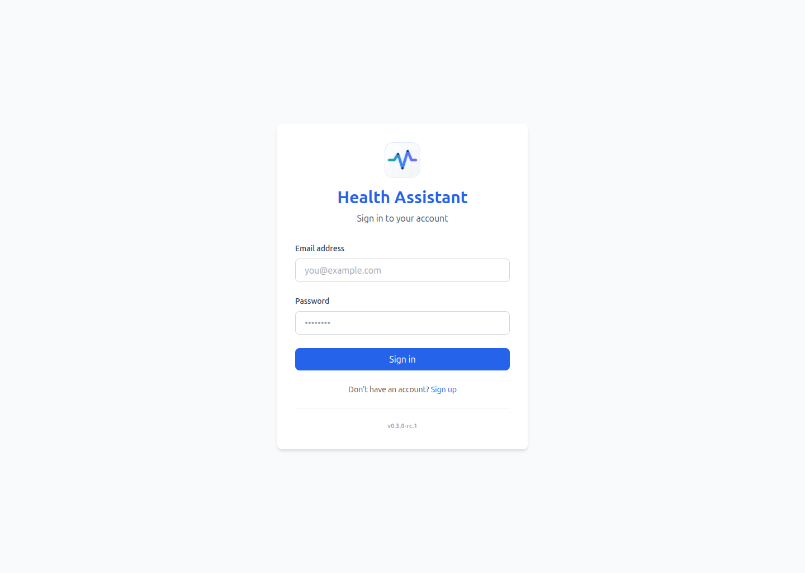
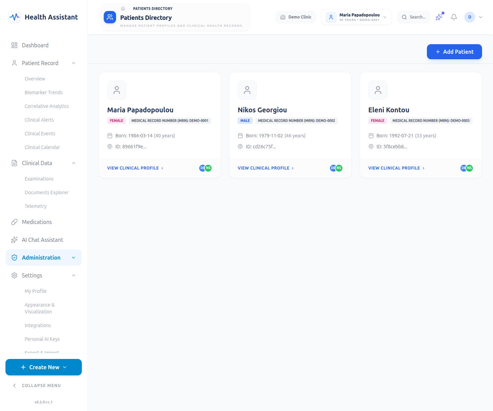
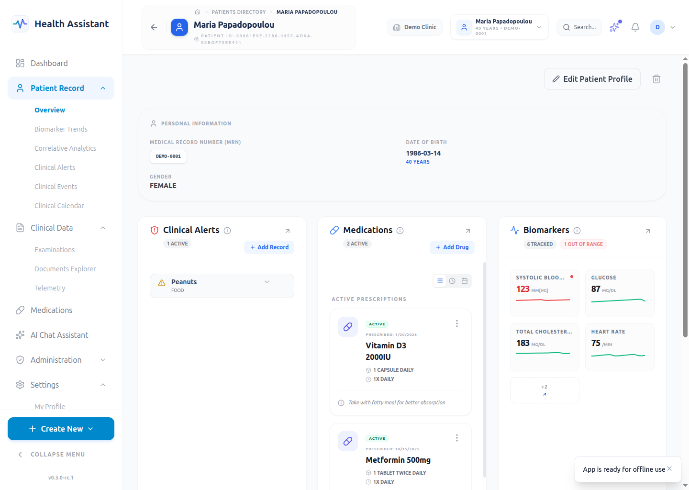
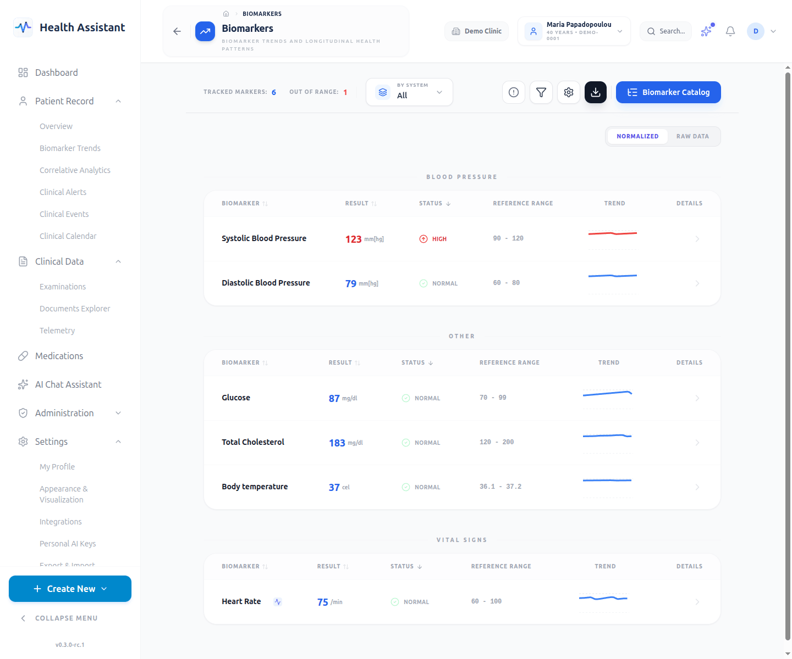
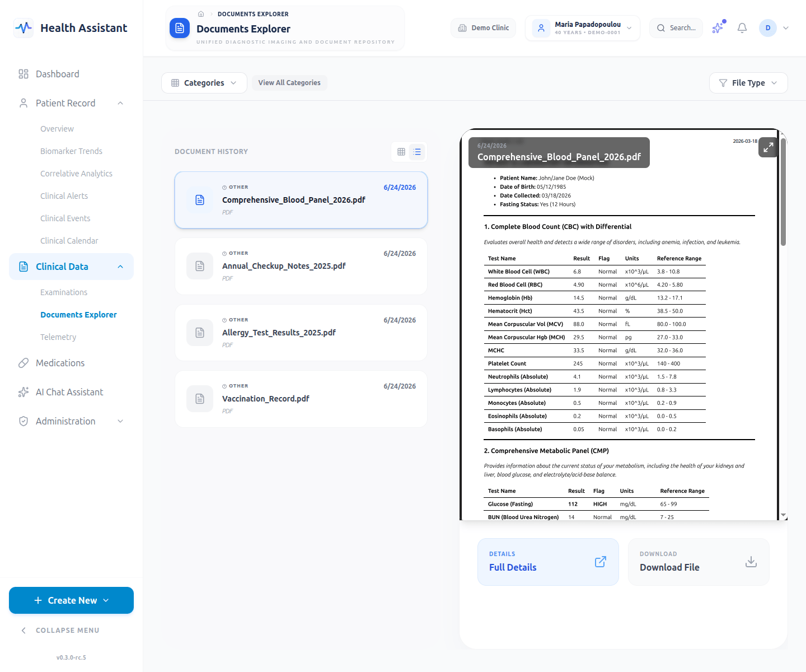
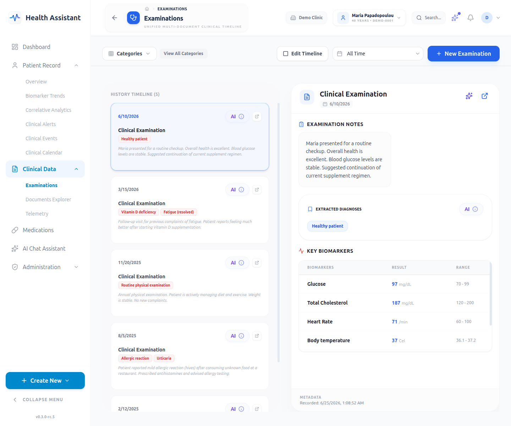

<!--
  AUTO-GENERATED by frontend/tests-e2e/ui-capture/gallery.mjs.
  Do not edit by hand — run `npm run capture:ui` to regenerate.
  To add a page, add a scene in frontend/tests-e2e/ui-capture/scenes.mjs.
-->

# Health Assistant — Visual Tour

Welcome to the visual tour of Health Assistant. These reproducible screenshots showcase the main pages and use cases of the application, generated against a deterministic seeded clinical dataset.

> Mobile views: not captured this run — pass `--viewport mobile` to the capture script to generate.

## Authentication

### login

_Sign-in screen — OAuth2 password grant against the FastAPI backend._

## Overview

### dashboard

_Patient dashboard with the draggable react-grid-layout widgets._

## Clinical data

### patients

_Patient list — tenant-scoped, paginated, with search._

### patient-detail

_Patient detail view — demographics, timeline, and linked resources._

### biomarkers

_Biomarker catalog — definitions, units, and reference ranges._

### documents

_Document list — uploaded exams/reports routed through the OCR pipeline._

### examinations

_Examination list — tracking patient visits, consults, and related diagnoses._

### examination-detail

_Examination detail view — structured clinical notes and linked entities._

### biomarker-detail

_Biomarker detail view — longitudinal trends and clinical significance._

## AI assistant

### ai-chat

_Agentic AI chat — tools, SSE streaming, and HITL task cards._

