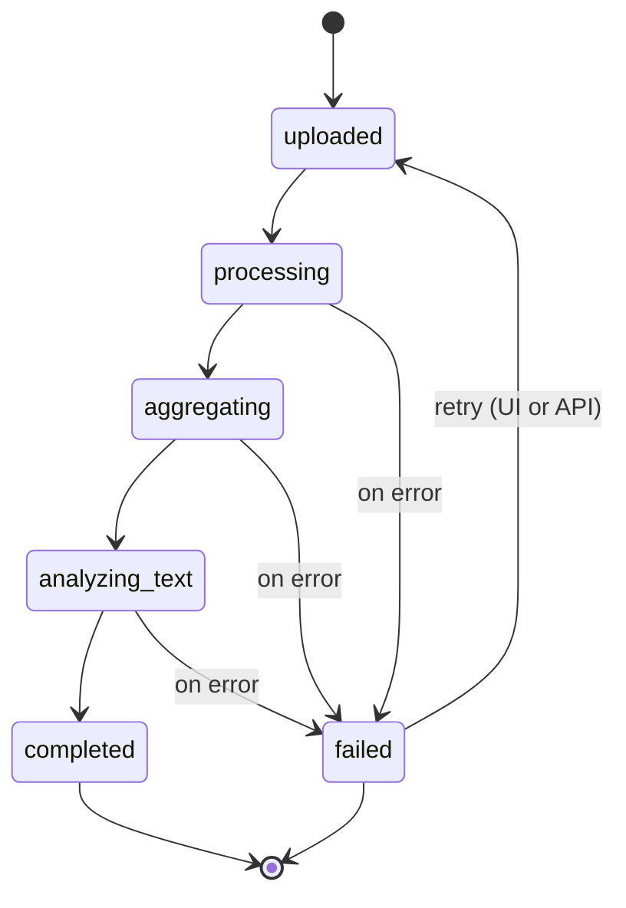
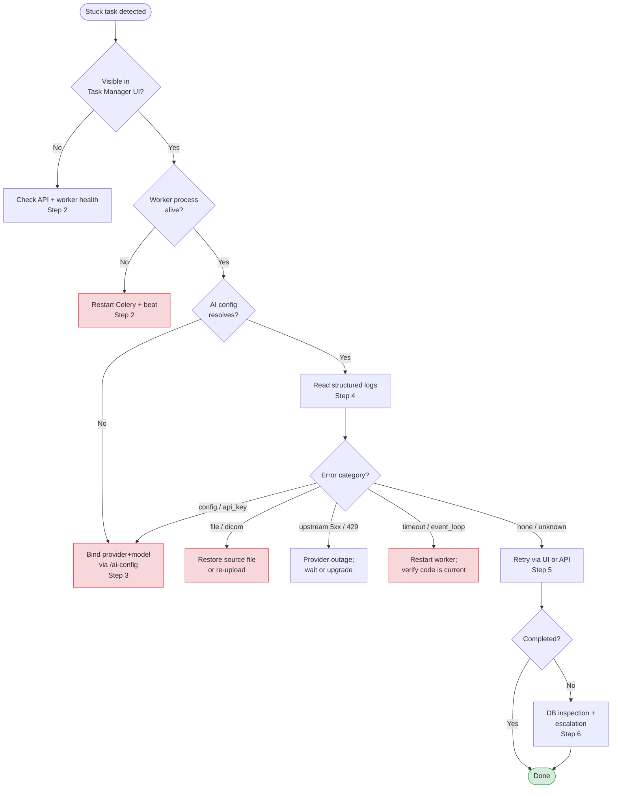

# Health Assistant — Task Debugging Guide

How to diagnose and recover stuck document-OCR and examination-extraction tasks.
Covers the `/task-monitor` operator surface, the underlying Celery pipeline,
structured-log inspection, and the retry workflow.

**Frontend page:** `http://localhost:8000/task-monitor` (operator UI)
**API surface:** [`/api/v1/task-monitor/*`](API.md#operations)
**Implementation:** `backend/app/workers/task_logger.py`, `backend/app/workers/ai_tasks.py`

> The AI/OCR pipeline runs in Celery workers (separate process from the FastAPI
> app — see [DEVELOPMENT.md](DEVELOPMENT.md)). A stuck task is almost always one
> of: the worker crashed, the upstream OCR/LLM provider is unreachable, the
> source file is missing on disk, or the AI config is mis-bound. This guide walks
> all four.

---

## Background: the task lifecycle

A document/examination moves through these statuses:



Two time thresholds matter:

| Threshold | Value | What it does |
|---|---|---|
| Celery hard `task_time_limit` | **15 minutes** | The worker is killed mid-task. The DB row is left in its current status. |
| `cleanup_stuck_extractions` beat | **20 minutes** | Beat task (`backend/app/workers/ai_tasks.py`) marks rows whose `updated_at < now − 20 min` as `failed` for these five statuses: `aggregating`, `analyzing_text`, `clinical_analysis`, `defining_ontology`, `persisting_results`. The 5-minute margin prevents a task killed at exactly 15 min from racing with cleanup. Runs every 5 minutes. |
| App lifespan startup cleanup | once at boot | A one-shot pass at FastAPI startup (`backend/app/main.py`) that marks rows older than 20 min as `failed` for a slightly different list: `processing`, `aggregating`, `analyzing_text`, `defining_ontology`, `persisting_results`. Ensures rolling restarts don't leave post-crash rows stuck. |
| Task Manager UI "stalled" badge | **10 minutes** | Purely visual — older than 10 min doesn't mean dead, just worth investigating. |

If Celery is not running at all, queued tasks silently accumulate in Redis and
never execute — the document/exam stays in `processing` forever. Always check
worker health first.

### Triage flow

The six steps below, as a decision tree. Start at the top and follow the first
branch that matches your symptom.



---

## Step 1 — Look at the Task Manager UI

Navigate to `/task-monitor` (operator UI; the route is registered in
`frontend/src/App.tsx`).

What you'll see:

- **Stats dashboard** — aggregate counts of documents + examinations per status,
  plus stalled-task counts (>10 min). Tenant-scoped for `ADMIN`/`MANAGER`;
  global for `SYSTEM_ADMIN`.
- **Processing documents** table — filename, status, progress bar, age, last
  error. Red "Stalled" badge if age > 10 min.
- **Processing examinations** table — category, status, progress bar, age.
- **Retry** button per row.

If a row shows progress `0%` for many minutes with no error message, the worker
is either dead or hung on the upstream OCR call (steps 2–3).

If a row shows progress `100%` but status still `processing`, the task crashed
during the final DB write — retry it.

---

## Step 2 — Verify the worker is alive

```bash
# Honcho-managed (dev)
honcho status            # lists running processes; celery + beat must be present

# Systemd (prod)
systemctl status celery
systemctl status celery-beat

# Docker
docker compose ps
docker compose logs --tail=200 celery
```

If the worker is not running, restart it (`systemctl restart celery`,
`docker compose up -d celery`, or `honcho start` in dev). Stuck rows will be
re-attempted only if you also click **Retry** (step 5) — Celery doesn't
auto-reclaim rows whose status is already `processing`.

---

## Step 3 — Verify the AI/OCR provider is configured

The pipeline resolves a provider+model via the per-task assignment chain
(`get_active_assignment_for_task`). A missing or inactive assignment falls back
to env vars (`OPENAI_*`); if neither is set, OCR fails immediately with a clear
error.

```bash
# What's currently resolved for OCR + NLP?
curl -s http://localhost:8000/api/v1/ai-config/default-for-task/ocr \
  -H "Authorization: Bearer $TOKEN" | jq
curl -s http://localhost:8000/api/v1/ai-config/default-for-task/nlp \
  -H "Authorization: Bearer $TOKEN" | jq
```

Expected shape:

```json
{
  "provider": {"name": "OpenAI Production", "scope": "system", "is_active": true},
  "model": {"name": "gpt-4o-mini", "is_active": true}
}
```

If `provider` is `null` or `is_active: false`, configure it via
`/ai-config/providers` + `/ai-config/task-assignments` (or the AI Configuration
admin page). See [AI_SYSTEM.md](AI_SYSTEM.md).

---

## Step 4 — Read the structured logs

Every Celery task logs structured JSON via `TaskLogger`
(`backend/app/workers/task_logger.py`). Sensitive data is redacted
(`api_key`/`token`/`secret`/`password`/`credentials` → `[REDACTED]`).

```bash
# Tail Celery output, filter to OCR
journalctl -f -u celery 2>&1 | grep -E '"task_name":\s*"ocr_document"'
# Or, in dev (honcho writes to stdout)
tail -f logging/celery.log | jq 'select(.task_name == "ocr_document")'
```

The same data is persisted to the `task_logs` DB table and surfaced via:

```bash
curl -s "http://localhost:8000/api/v1/examinations/{exam_id}/logs" \
  -H "Authorization: Bearer $TOKEN" | jq
```

What to look for:

| Log signal | Meaning | Fix |
|---|---|---|
| `ocr_start` stage with no completion log | Upstream provider hang or 5xx | Check provider status page; verify API key |
| `FileNotFoundError` (any stage) | Source file moved/deleted/permissions | Verify `UPLOAD_DIR`; restore file; retry |
| `pydicom` error / DICOM processing failure | pydicom couldn't read the `.dcm` | File corrupt; re-upload |
| Upstream `401 Unauthorized` | AI provider API key invalid | Rotate key in `/ai-config/providers/{id}` |
| Upstream `429 Too Many Requests` | Provider rate limit | Reduce concurrency or upgrade plan |
| `RuntimeError: Event loop is closed` | Per-task engine reuse bug | Ensure workers run current code (audit A7 fixed) |
| No log lines at all for the task_id | Worker didn't pick it up | Step 2 (worker alive? beat scheduling?) |

Error categories emitted by `TaskLogger._categorize_error` (`backend/app/workers/task_logger.py`):
`file` / `validation` / `system` / `api` / `unknown` (fallback). Map roughly
to: file → `FileNotFoundError`/permissions; validation → schema/pydantic
failures; api → upstream provider 4xx/5xx; system → DB/network/`RuntimeError`;
unknown → uncategorized exceptions.

---

## Step 5 — Retry the stuck task

From the UI: click **Retry** on the row.

Via API:

```bash
# Retry OCR for a single document
curl -X POST http://localhost:8000/api/v1/task-monitor/documents/retry/{document_id} \
  -H "Authorization: Bearer $TOKEN"
# → {"message": "Document OCR will be retried", "document_id": "..."}

# Re-trigger extraction for an examination (uses already-OCR'd text)
curl -X POST http://localhost:8000/api/v1/task-monitor/examinations/retry/{examination_id} \
  -H "Authorization: Bearer $TOKEN"
```

Retry resets the row to `uploaded` (document) or clears the extraction status
(examination) and re-enqueues the Celery task. The retry is **idempotent** for
the DB row but **not** for upstream provider billing — a successful retry calls
the OCR/LLM provider again and consumes tokens.

Expected timeline after a successful retry:

- 0–30 s — task starts, progress → 10%
- 30–120 s — OCR + extraction, progress → 50% → 100%
- Final — status → `completed`

If the retried task fails again within seconds, the root cause is config or the
file — read the new structured log line.

---

## Step 6 — Direct DB inspection (last resort)

Useful when the API/UI themselves are misbehaving.

```sql
-- Documents currently processing or stalled
SELECT id, tenant_id, filename, status, progress,
       EXTRACT(EPOCH FROM (now() - updated_at))/60 AS age_minutes,
       error_message
FROM documents
WHERE status IN ('processing', 'uploaded')
ORDER BY updated_at;

-- Examinations currently extracting or stalled
SELECT id, tenant_id, category, extraction_status, extraction_progress,
       EXTRACT(EPOCH FROM (now() - updated_at))/60 AS age_minutes
FROM examinations
WHERE extraction_status IN ('processing', 'aggregating', 'analyzing_text')
ORDER BY updated_at;

-- The last 50 task_log rows for a specific tenant
SELECT created_at, task_name, level, message, data
FROM task_logs
WHERE tenant_id = '<uuid>'
ORDER BY created_at DESC
LIMIT 50;
```

---

## Common failure modes → fix

| Symptom | Likely cause | Fix |
|---|---|---|
| Many rows stuck at `0%`, no error logged | Celery worker not running | Step 2 |
| `config_check` error in logs | AI provider inactive or assignment missing | Step 3 |
| `FileNotFoundError` in logs | Source file missing from `UPLOAD_DIR` | Restore file or delete the document row |
| `upstream 401 Unauthorized` | AI provider API key invalid | Rotate key in `/ai-config/providers/{id}` |
| `upstream 429 Too Many Requests` | Provider rate limit | Reduce concurrency or upgrade plan |
| DICOM `pydicom` error | File not valid DICOM | Re-upload; convert to images first |
| Row marked `failed` immediately on retry | Validation/concurrency error | Read the structured `data.error_message` |
| `RuntimeError: Event loop is closed` in worker logs | Per-task engine reuse bug (was audit A7) | Already fixed — ensure workers run current code |
| Tasks queue but never run after a deploy | Beat schedule drift or stale worker | Restart `celery` + `celery-beat` |

---

## Prevention

- **Health check**: `/health` returns DB connectivity; pair with a Celery-worker
  liveness check (`celery inspect ping`).
- **Monitoring**: alert when `task_monitor /stats` reports `stalled_count > 0`
  for >5 min, or when the per-status queue depth is non-monotonic.
- **AI config snapshots**: snapshot the active OCR + NLP assignments
  (`/ai-config/summary`) before each deploy so a regression is quick to spot.
- **`UPLOAD_DIR` on persistent volume**: a common cause of `FileNotFoundError`
  after a redeploy is `UPLOAD_DIR` not surviving the container lifecycle.
- **Keep Celery + beat on the same image version** as the API — schema/serializer
  drift between API and worker produces silent task failures.

---

## See also

- [API.md → Operations](API.md#operations) — `/task-monitor/*` route reference
- [AI_SYSTEM.md](AI_SYSTEM.md) — the AI provider factory + OCR/NLP pipeline
- [DEVELOPMENT.md](DEVELOPMENT.md) — running the full dev stack (API + worker + beat)
- [SEEDING_AND_DEMOS.md](SEEDING_AND_DEMOS.md) — deterministic demo data
