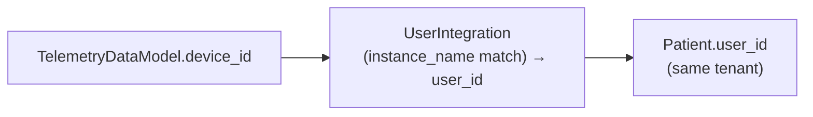

# Telemetry & TimescaleDB Architecture

This document tracks the design decisions and architecture for handling high-frequency health data (IoT devices, wearables, continuous monitors) in Health Assistant.

## The Problem
Standard clinical data maps beautifully to the HL7 FHIR `Observation` model. A blood test taken once every 3 months is easily stored in the `fhir_observations` PostgreSQL table.
However, devices like the Apple Watch, Oura Ring, or continuous glucose monitors (CGMs) can generate health measurements every 1 to 5 minutes. Routing this data into standard FHIR structures results in massive table bloat, drastically degrading dashboard performance and slowing down routine clinical queries.

## The Solution: Split Architecture
Health Assistant implements a frequency-based routing architecture:

1. **Low-Frequency (Clinical) Data -> FHIR Observations**
   - Stored in standard `fhir_observations` table.
   - Used for blood panels, point-in-time weight, diagnostic results.

2. **High-Frequency (Telemetry) Data -> TimescaleDB**
   - Stored in the `telemetry_data` hypertable.
   - Extremely high ingestion limits and heavily compressed.

## Dynamic Routing via Biomarker Definitions
Instead of hardcoding which metrics go to which database, routing is configurable.
The `biomarker_definitions` table includes an `is_telemetry` boolean flag.
When integration webhooks push data to the backend, the parser resolves the data to a standard biomarker. The core sync engine then inspects this flag:
- If `is_telemetry = true`: Data is mapped to a `TelemetryDataModel` and saved to TimescaleDB.
- If `is_telemetry = false`: Data is mapped to an `Observation` and saved to FHIR.

**Automated Data Migration:** System administrators can toggle this flag via the UI, making the system infinitely expandable for future IoT devices without requiring code changes. When the flag is toggled on an existing biomarker, the Celery task `migrate_biomarker_data` performs an automatic, batched (5000 rows) migration between the standard PostgreSQL `fhir_observations` table and the TimescaleDB `telemetry_data` hypertable. For extremely large historical datasets, headless CLI scripts (`backend/scripts/migrate_heart_rate.py`) are also available to chunk migrations without timing out browser API requests.

**Telemetry → FHIR patient attribution (audit C1):** the
`telemetry_data` hypertable has **no `patient_id` column by design** —
telemetry rows are scoped only by `tenant_id` + `device_id`. When an
admin flips `is_telemetry` true→false on a populated biomarker, the
migration task must resolve a `Patient` for each row before constructing
an `Observation` with `subject={"reference": f"Patient/{id}"}`. The
chain is:

- Rows whose `device_id` resolves to exactly one patient get attributed
  to that patient.
- Rows that can't be attributed (unknown device + multi-patient tenant)
  are **skipped**, not silently assigned to the first patient. The
  count is exposed in `BiomarkerDefinition.meta_data["migration_skipped_no_patient"]`.
- The single-patient-tenant case remains the safe fallback (unambiguous
  attribution).
- If **no** rows can be attributed (no `UserIntegration` in tenant AND
  the tenant has multiple patients), the migration aborts with
  `meta_data["migration_status"] = "failed"` and a clear
  `meta_data["migration_error"]` instead of corrupting data.
- The legacy `device_id == "fhir_migration"` marker (set by the
  FHIR→telemetry direction) is treated as un-attributable.

## Data Storage Strategy
The `telemetry_data` table is optimized for both speed and flexibility:
- **Core Columns:** Highly common metrics (`heart_rate`, `steps`, `calories`) have dedicated SQL columns for maximum index performance.
- **Dynamic Metrics:** A `data` JSONB column captures the long tail of specific IoT metrics (e.g., continuous temperature, SpO2, glucose). The JSONB column utilizes a GIN index (`jsonb_path_ops`) ensuring sub-millisecond querying even on arbitrary JSON keys.

## Preserving Spikes (OHLC Aggregation)
When rendering a dashboard for "The Last 6 Months", fetching minute-by-minute heart rate data would crash a user's browser.
Data must be downsampled. However, taking a pure mathematical `AVERAGE()` hides critical clinical data (e.g., a dangerous 10-minute spike to 190 bpm).

To solve this, the `AnalyticsService` uses **TimescaleDB OHLC (Open-High-Low-Close) Aggregations**:
- `time_bucket_gapfill()` ensures missing days (e.g. user forgot to wear the watch) are returned as `NULL` rather than connected across the graph.
- The query returns `AVG()`, `MIN()`, and `MAX()` for each bucket.
- The frontend renders this as an average line with a shaded variance envelope (Min to Max), guaranteeing that the absolute highest spike during that timeframe remains visibly represented on the chart.

**Decoupled Aggregation Resolution:**
The system decouples the "Temporal Scope" (e.g., viewing the Last 30 Days) from the "Aggregation Bucket" (e.g., grouping by 1-hour averages). Users can dynamically adjust the resolution density directly from the UI dropdowns, and the backend securely handles the dynamic PostgreSQL `INTERVAL` casting (e.g. `1 minute`, `15 minutes`, `1 day`, `1 week`).

## Future Considerations (Roadmap)
- **Data Lifecycle & Pruning:** Currently, telemetry data is not automatically pruned. For active users with high-frequency tracking (e.g., Apple Watch syncing every minute), the database will grow continuously. System administrators should be aware of this and implement manual cron jobs or TimescaleDB retention policies to prevent disk space exhaustion until automatic pruning is formally supported.
- **Continuous Aggregates:** As databases reach millions of rows, we should configure TimescaleDB Continuous Aggregates (Materialized Views) to automatically pre-calculate daily and hourly buckets in the background.
- **Compression Policies:** Implement TimescaleDB native compression policies (e.g., `compress_after => INTERVAL '7 days'`) to achieve 90%+ storage savings on raw minute-by-minute data older than a week.
- **FHIR Interoperability Boundary:** The split architecture inherently moves high-frequency telemetry data outside of strict FHIR compliance. Currently, when exporting patient records to FHIR, telemetry data is excluded. Future versions will need to dynamically downsample and map TimescaleDB data back into FHIR `Observation` bundles during export.

## Unified Clinical View (UI & AI Integration)
Despite the data being physically split across two different database engines, both the frontend and the AI Chatbot provide a unified longitudinal view.

1. **Frontend:** The `BiomarkerDetail` view uses the `AnalyticsService` to merge and sort FHIR and TimescaleDB data.
2. **AI Chatbot:** The AI Assistant uses the `get_aggregated_biomarker_trends` tool, which routes through the same `AnalyticsService` logic. This ensures the AI can reason over high-frequency wearable data (steps, heart rate) without being overwhelmed by raw records, while strictly adhering to aggregated OHLC (Average, Min, Max) values.

This is achieved dynamically by the `AnalyticsService` in the backend:
1. **FHIR Data:** The service queries standard `fhir_observations` matching the `biomarker_id`.
2. **Telemetry Data:** The service inspects the `slug` of the biomarker (e.g., `"heart-rate"`, `"oxygen-saturation"`). It then queries the TimescaleDB `telemetry_data` table, pulling metrics that match either the hardcoded high-performance columns (like `heart_rate`) or dynamically querying the `data` JSONB column (`WHERE data ? 'oxygen-saturation'`).
3. **Merge & Sort:** The backend formats both datasets into the identical JSON response structure, sorts them chronologically by timestamp, and returns them to the requester (React chart or AI Tool) as a single cohesive longitudinal record.
